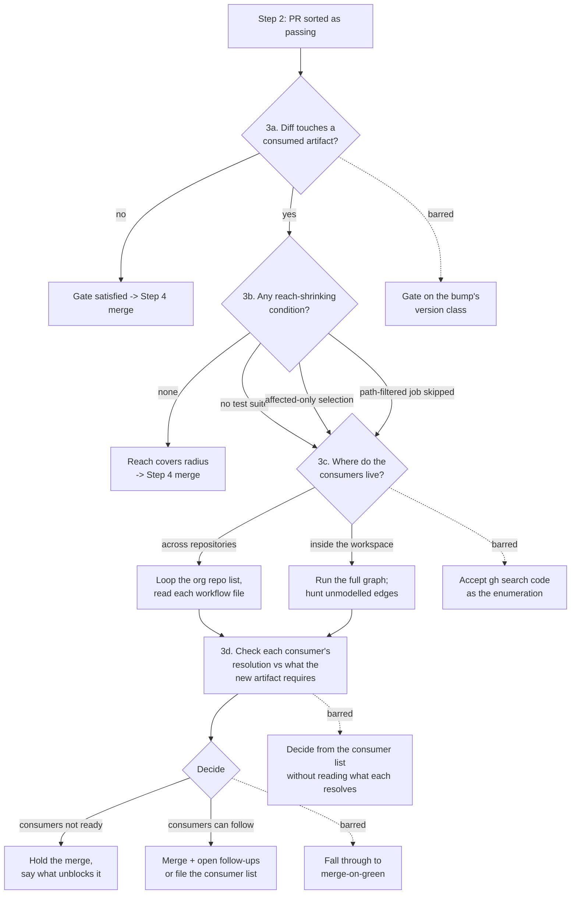

# merge-dep-prs — the merge gate

## What

`merge-dep-prs` works through a repository's open dependency-update pull requests. It classifies
them, merges the safe ones, fixes the ones whose checks fail, and refuses to touch anything whose
purpose is to trigger a release.

**This node specifies one decision inside that skill: when a dependency PR may be merged.** Nothing
else about the skill is specified here.

### The problem

The skill's merge condition used to be **"CI is green."**

A green check is evidence about exactly one thing — what CI actually executed. It says nothing about
anything CI did not run. So a dependency PR can be correct in every visible way, pass every check in
its own repository, and still break every consumer of the artifact it changed, because no check ever
exercised a consumer.

The incident that produced this node: a bump of `changesets/action` v1 → v2.1.0 in an organisation's
`.github` repository, in the reusable release workflow that thirty repositories call. The pull
request renamed every v2 input correctly and explained its rationale. It passed every check. The v2
action then refuses `@changesets/cli` v2 at run time, and the release job broke in twenty-five
downstream repositories — each staying green until its own next push to `main`, then going red one
at a time, days apart.

### The rule

Two independent quantities:

| Term | Plain meaning |
|---|---|
| **Blast radius** | what consumes the artifact this pull request changes |
| **Verification reach** | what the green check actually ran |

**A merge is safe when reach covers radius** (reach ⊇ radius). Where reach falls short, green
carries no information about the uncovered part. That is not weak evidence; it is no evidence.

A `.github` repository is the extreme case, and it is instructive because it is *degenerate*: it has
no test suite, because it has nothing to test locally — everything it ships executes somewhere else.
Its checks are green **by construction**. Zero reach, thirty consumers.

### Why the axis is not semver

An earlier framing gated on **major version bumps to consumed artifacts**. That is the wrong axis:
semver describes the **dependency being bumped**, while the risk belongs to the **artifact being
changed** and to whoever executes it.

- **Misses real breaks.** A reusable workflow that changes an input default, a preset that tightens
  a rule, a package that narrows a peer range in a minor — consumers pin `@v2` / `main` / `^1` and
  get it regardless. In the incident above the mechanism was a **run-time probe**: the action
  inspects the consumer's CLI version and refuses. A **patch** release adding that probe would have
  broken the same twenty-five repositories.
- **Stops safe merges.** A major devDependency bump in a leaf repository with real local coverage has
  no blast radius and needs no gate at all.

### The same failure with no repository boundary

Nothing here is specific to `.github` repositories or to multi-repository setups. Inside one
monorepo: package A changes; CI runs `turbo run test --filter=...[origin/main]` (or `nx affected`, or
a `paths:`-filtered job); package B depends on A through a run-time config load, a generated file, or
a peer — an edge the selector's graph does not have. B's tests never run. Green. B breaks on the next
full run, or at publish.

No repository boundary, no version number, no major bump, and the identical failure. Selective test
execution is *deliberately* shrinking reach; it is safe exactly as far as the dependency graph is
complete. The in-repo path is therefore a first-class branch of the gate, not a footnote to the
cross-repo one.

### Non-goals

- **The rest of `merge-dep-prs`.** Pull-request classification, CI triage, the fix recipes, changeset
  handling and closing obsolete pull requests are **not yet backfilled**. Their absence is a gap on
  the `agent-skills` worklist, not a claim that they are unspecified by design.
- **Deriving blast radius from a connection graph in the general case.** Doing that at any level, for
  any artifact kind, belongs where connections between artifact-sets are the central object of the
  model. This node covers the local, dependency-pull-request-shaped instance of it.
- **Executing the follow-up work.** The gate decides and records; opening the consumer pull requests
  is the merging agent's ordinary work afterwards.

### Key terms

- **Consumed artifact** — something this repository publishes that *other* code executes: a reusable
  workflow, a composite action, a published package or preset, a container image, or a workspace
  package other packages depend on.
- **Reach-shrinking condition** — a property of the CI setup that makes the green check cover less
  than the whole repository.

## Use Cases

**Fit:** partial — the gate is a step inside an already-invoked skill. It makes no activation
decision of its own, so it has no should-trigger/near-miss axis; its behaviour is still agent-run
and judged.

**Actors, and the goals they arrive with.**

| Actor | Invokes? | Goal (their result, not the call) |
|---|---|---|
| The agent working a dependency-PR queue | yes | land the update without breaking anything that was not tested |
| The repository maintainer reviewing the run | no — reads the outcome | know why a PR was held, and what would unblock it |
| A consuming repository's maintainer | no — affected by the outcome | not discover the break days later, on their own next push |
| A consuming repository's release automation | no — affected by the outcome | keep running against the artifact it resolves |

**Surface trace.** The gate exposes no flags or options. Its whole surface is the three outcomes of
the gate — `merge` (UC-1's), `hold` and `merge + follow-ups` (UC-2's). Nothing on the surface is
unaccounted for.

### UC-1 — gate a dependency pull request before merging it (`Step 3`)

**Actor / goal.** The agent working the queue wants to land the update without breaking anything that
was not tested.

| Part | Value |
|---|---|
| Trigger | Step 2 has sorted a dependency pull request as having passing checks |
| Inputs | the pull request's diff; the repository's CI configuration |
| Outcome | either the gate is satisfied and the agent proceeds to merge (Step 4), or reach is established as short of radius and UC-2 runs |

**Extensions.**

| Cause | Outcome |
|---|---|
| The diff touches no consumed artifact | the gate is satisfied immediately — no consumer enumeration |
| The diff touches a consumed artifact but CI runs the whole suite unfiltered | the gate is satisfied — reach already covers radius |
| The repository has no test suite at all | reach is zero; UC-2 runs however green the checks are |
| Tests are selected by affected-only or changed-files selection | reach is short of the graph; UC-2 runs |
| A path-filtered job skipped on this diff | that job did not pass; UC-2 runs |
| The agent is offered the bump's version class as the gate condition | refused — the gate never keys on semver |

### UC-2 — enumerate the consumers and decide (`Step 3c`–`3d`)

**Actor / goal.** The same agent wants the true consumer list and a decision someone made, rather
than a merge that happened because nothing objected. The repository maintainer wants that decision
legible; the consuming repositories' maintainers and release automation are affected by it without
invoking anything.

| Part | Value |
|---|---|
| Trigger | UC-1 established that verification reach does not cover blast radius |
| Inputs | the consumed artifact's identity; the organisations or workspace that could consume it |
| Outcome | a consumer list, each consumer's resolution checked against what the new artifact requires, and one recorded decision — **hold**, or **merge + follow-ups** |

**Extensions.**

| Cause | Outcome |
|---|---|
| The artifact is consumed across repositories | enumerate by looping the organisation's non-archived repositories and reading each one's workflow file |
| `gh search code` is proposed as the enumeration | refused — it misses organisation-internal matches |
| The artifact is consumed inside one workspace | run the full task graph unfiltered, then look for edges the selector cannot model |
| The consumer list is offered as the check | refused — a list of consumers is not a check of what they resolve |
| Every check is green and no consumer objected | irrelevant — an unenumerated consumer set is not an empty one; merge-on-green is not an outcome |

## Control Flow

## Scenario map

### UC-1 — gate a dependency pull request before merging it

| Edge | Path (Given) | Scenario |
|---|---|---|
| `S→A` | a PR just sorted as passing | `inspects the diff for consumed artifacts before it merges anything` |
| `A→OK1` | diff touches nothing consumed | `merges without enumerating consumers when nothing consumed is touched` |
| `A→B` | diff touches a consumed artifact | `detects a consumed artifact by path` |
| `B→OK2` | consumed artifact, unfiltered full suite | `merges when the full suite already covers the changed artifact` |
| `B→C` (no test suite) | an org `.github` repo, green, no suite | `treats a repository with no test suite as zero reach, not zero risk` |
| `B→C` (affected-only) | a monorepo filtering tests to the affected set | `treats affected-only test selection as reach falling short` |
| `B→C` (path-filtered skip) | a job whose `paths:` filter excluded this diff | `treats a skipped path-filtered job as unverified, not as passed` |
| `A-.barred.->X1` | a patch bump that changes a consumed artifact | `does not key the gate on the bump's version class` |

### UC-2 — enumerate the consumers and decide

| Edge | Path (Given) | Scenario |
|---|---|---|
| `C→C1` | a reusable workflow, consumers across an org | `enumerates cross-repo consumers by looping the org repo list` |
| `C→C2` | a workspace package, consumers in-repo | `enumerates in-repo consumers by running the full graph and hunting unmodelled edges` |
| `→D` (reconvergence of `C1→D` and `C2→D`) | any produced consumer list, cross-repo or in-repo | `checks what each consumer resolves against what the new artifact requires` |
| `D-.barred.->X4` | a produced consumer list, nothing read from it | `does not treat the consumer list as the resolution check` |
| `E→H` | consumers resolve something the new artifact refuses | `holds the merge and names what would unblock it` |
| `E→M` | consumers can be migrated after the merge | `merges and immediately opens the follow-ups or files the consumer list` |
| `C-.barred.->X2` | `gh search code` proposed as the enumeration | `does not accept gh search code as the consumer enumeration` |
| `E-.barred.->X3` | green checks, reach short, nobody objected | `does not fall through to merge-on-green while reach is short of radius` |
