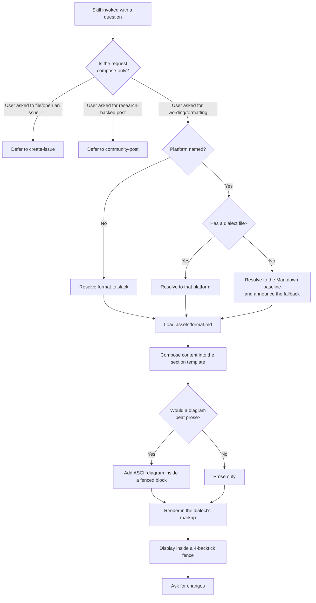

# to-question

## What

A person has a technical question they have been chewing on — a design fork, an edge case, a "which
of these three do we do" — and they are about to paste it somewhere for other people to answer. Left
alone, that paste tends to go out as a wall of prose with the actual question buried in the last
line, and it renders wrong besides, because Slack and Jira do not accept the Markdown everyone
reflexively types.

`to-question` does two things about that. It **composes** the half-formed question into a fixed
shape — Context, Use Cases, Problem, Options, Questions — so the thing being asked is actually
visible. Then it **renders** that content in the target platform's own markup dialect, so it looks
right when pasted. It shows the result, takes revisions until the person is happy, and hands the
final text off through the clipboard.

It stops there, deliberately. It never posts.

**Key terms**

- **Composition** — turning a half-formed question into the structured sections.
- **Rendering** — expressing those sections in one platform's markup dialect.
- **Markup dialect** — the syntax a platform accepts. Slack's mrkdwn (`*bold*`) and Jira's wiki
  markup (`h2.`) are not Markdown, and Markdown pasted into them renders as literal punctuation.
- **Handoff sink** — where the finished text is left: a file at `/tmp/question.md` and, where one is
  available, the system clipboard.

### Non-goals

- **Delivering the post.** No posting, filing, sending, or authenticating. A user who wants the
  thing to *exist* on a tracker is routed to `create-issue`; one who wants it researched first is
  routed to `research-workbench:community-post`. The reasoning is
  [ADR 0001](../../design/decisions/0001-to-question-owns-composition-not-delivery.md), and the
  routing rule is [posting-skill-boundaries](../../design/posting-skill-boundaries.md).
- **Duplicate checking.** `create-issue` searches for existing issues before filing because filing a
  duplicate is a real harm. Composing text carries no such risk, and this skill does not search.
- **Research.** It works from what the user brings. It does not go find prior art.
- **Content shapes other than a question.** The section template is fixed. A bug report, an RFC, a
  status update, or a code-review comment are *not* served by it today — see *Known gaps*.

### Known gaps in the shipped behavior

This spec is a backfill of PR #577, and records what the skill does, not what it should do.
Backfilling surfaced four places where the shipped instructions did not determine an outcome. All
four are now resolved on this branch.

1. **Unrecognized format token — resolved.** The procedure said "determine target format from user
   input (default: `slack`)" without saying what happens when the user names a platform that has no
   asset — `discord`, `teams`, `notion`. Falling back to `slack` silently and treating the word as
   part of the topic were both consistent with the text, and gave very different results.
   **Settled as: fall back to the Markdown baseline and say so.** Most unlisted candidates are
   Markdown-family, so the baseline is usually right; and because it can be wrong, the fallback is
   announced rather than silent. Slack and Jira are excluded from it by name — neither accepts
   Markdown, so falling back there would produce literal punctuation.
2. **Clipboard failure — fixed.** Three copy commands were listed, one per OS, with no instruction
   for choosing between them and no branch for the case where none is available (a headless agent, a
   CI run, a Linux box without `xclip`/`wl-copy`, a web session). Because the clipboard is the
   handoff sink, that silently lost the output the user had just approved — and the skill still
   reported success. The skill now probes for a command, adds `wl-copy` for Wayland, and on finding
   none says so and points at the file instead of claiming a copy happened.
3. **Email was not clipboard-shaped — fixed.** `assets/email.md` tells the user to render the
   Markdown and paste the *rendered* result as rich text, but the procedure copied raw Markdown to
   the clipboard, so for the `email` target the two steps contradicted each other. The handoff step
   now carries the render-then-paste instruction for that target.
4. **The description did not describe a trigger — fixed.** The skill's frontmatter `description` is
   the surface the harness matches a user's request against, so for a strong-fit skill it is the
   activation decision's main input. It read as a statement of what the skill does rather than when
   to use it, while both skills it competes with (`create-issue`, `community-post`) lead with "Use
   this skill when…" — so on a request the three all plausibly match, this one was the weakest
   worded. It now leads with the trigger and says *paste*, which is the word that separates it from
   filing.

Separately, the six template files under `assets/` are unchanged in content, but three of them
(`github`, `gitlab`, `email`) wrapped a template containing triple-backtick blocks in a
triple-backtick fence, so the block terminated at the first nested fence and the rest of the
template read as loose prose. They now use four-backtick fences, the same way the skill's own
display step does.

## Use Cases

**Fit:** strong

`to-question` makes a genuine activation decision — its domain overlaps two sibling skills that use
the same vocabulary — and its composition step is judgment, not mechanism.

| # | Use case | Trigger | Inputs | Outcome |
|---|---|---|---|---|
| 1 | **Compose for the default platform** | User asks for help wording/formatting a technical question and names no platform | The question plus whatever context they gave | A Slack-mrkdwn draft, displayed for review |
| 2 | **Compose for a named platform** | User names one of the six supported platforms | The question, context, and the platform name | A draft in that platform's dialect, displayed for review |
| 3 | **Revise the draft** | User responds to a displayed draft asking for a change | The change they asked for | A revised draft, displayed again for review |
| 4 | **Hand off the approved draft** | User signals the draft is good | The approved draft | Written to `/tmp/question.md`, copied to the clipboard, and the user told which platform to paste into |

Use cases 1 and 2 enter the same composition sub-graph and differ only at the format-resolution
edge. Use cases 3 and 4 are the two exits from the review loop.

## Control Flow

### Composition and rendering (use cases 1, 2)

The 4-backtick fence at display is not cosmetic: every template contains triple-backtick blocks, so
a triple-backtick wrapper would terminate at the first nested block and the rest of the draft would
render as loose text.

### Review loop (use cases 3, 4)

The loop has no iteration cap: it exits only on approval.

The clipboard branch is the capability's failure mode, not a nicety — the clipboard *is* the
handoff, so reporting a copy that did not happen loses the approved output silently.

## Scenario map

### Use cases 1–2 — compose for a platform

| Edge | Path (Given) | Scenario |
|---|---|---|
| `B -->|wording/formatting| E` | user has a half-formed technical question | `` `composes when asked to word a question for posting` `` |
| `B -->|file/open an issue| C` | same repo, user says "file a bug" | `` `stays out when the user asks to file an issue` `` |
| `B -->|research-backed post| D` | user wants prior art gathered first | `` `stays out when the user asks for a researched post` `` |
| `E -->|No| F` | no platform named anywhere in the request | `` `defaults to slack when no platform is named` `` |
| `G -->|Yes| G1` | user named jira | `` `renders jira wiki markup when jira is named` `` |
| `G -->|Yes| G1` | user named linear | `` `caps headings at four levels when linear is named` `` |
| `G -->|No| G2` | user named notion, which has no dialect file | `` `falls back to the markdown baseline and announces it` `` |
| `G -->|Yes| G1` (guard) | user named slack, whose dialect rejects markdown | `` `does not fall back to markdown for slack` `` |
| `H` (asset load) | target platform is slack | `` `reads the platform asset rather than recalling its syntax` `` |
| `I` (compose) | user supplied only a problem, no options | `` `composes the section template from a half-formed question` `` |
| `J -->|Yes| K` | question is about a state machine | `` `puts an ASCII diagram inside a fenced block` `` |
| `M` (render) | target platform is slack | `` `renders slack bold as single asterisks, never double` `` |
| `N` (display) | draft contains a fenced code block | `` `wraps the displayed draft in a 4-backtick fence` `` |

### Use case 3 — revise the draft

| Edge | Path (Given) | Scenario |
|---|---|---|
| `P -->|Asks for a change| Q` | draft displayed, user wants an option dropped | `` `revises and redisplays when the user asks for a change` `` |
| `R --> O` | second draft displayed | `` `keeps inviting changes rather than handing off unprompted` `` |

### Use case 4 — hand off the approved draft

| Edge | Path (Given) | Scenario |
|---|---|---|
| `P -->|Approves| S` | user says the draft is good | `` `writes the approved draft to a file on approval` `` |
| `T -->|Yes| U` | approved draft, target platform slack, pbcopy present | `` `copies to the clipboard and names the platform to paste into` `` |
| `T -->|No| V` | approved draft on a headless box with no clipboard command | `` `reports no clipboard rather than claiming a copy that did not happen` `` |
| `W -->|Yes| X` | approved draft, target platform email | `` `tells the user to render before pasting when the target is email` `` |
| `S` (guard) | draft displayed, user has not approved | `` `does not copy to the clipboard before approval` `` |
