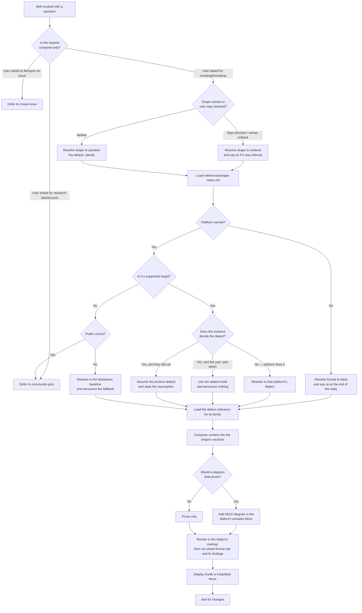
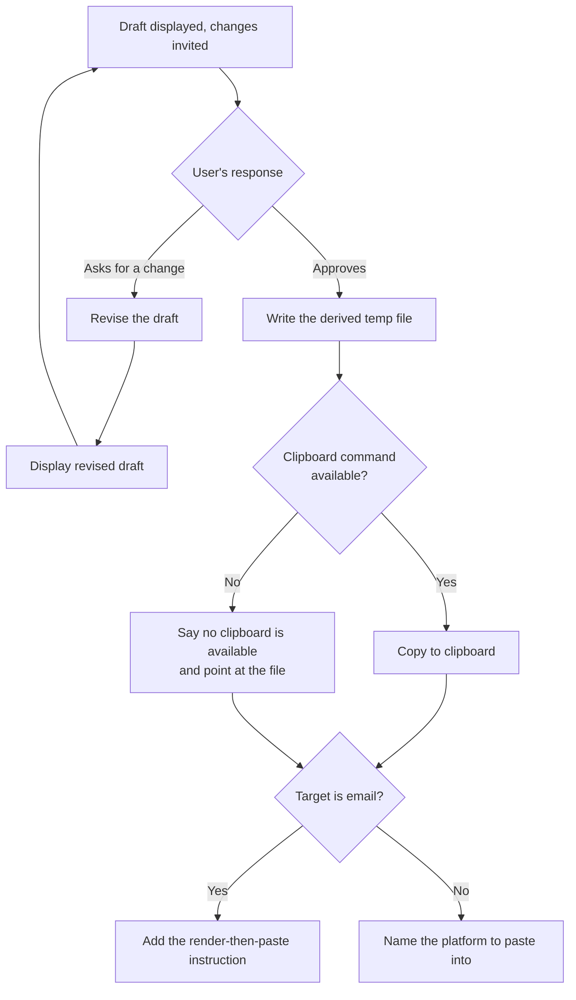

# to-question

## What

A person has a technical question they have been chewing on — a design fork, an edge case, a "which
of these three do we do" — and they are about to paste it somewhere for other people to answer. Left
alone, that paste tends to go out as a wall of prose with the actual question buried in the last
line, and it renders wrong besides, because Slack and Jira do not accept the Markdown everyone
reflexively types.

`to-question` does two things about that. It **composes** the half-formed question into a named
**content shape** — by default Context, Use Cases, Problem, Options, Questions — so the thing being
asked is actually visible. Then it **renders** that content in the target platform's own markup
dialect, so it looks right when pasted. It shows the result, takes revisions until the person is
happy, and hands the final text off through the clipboard.

It stops there, deliberately. It never posts.

**Shape and dialect are two independent parameters.** The dialect was always one; the shape used to
be hardcoded, which made the assumption behind it — *the user is undecided between alternatives and
wants input* — invisible. Two shapes ship:

| Shape | The user's situation | Sections | Default |
|---|---|---|---|
| `question` | Undecided between alternatives, wants input | Context → Use Cases → Problem → Options → Questions | ✓ |
| `unblock` | Stuck, needs a named person to do a named thing | Blocked on → Already tried → **What I need from you** → By when | |

`question` is the default, so a request naming no shape composes exactly as it did before the
parameter existed. `unblock` is chosen when the user's own words say they are blocked, stuck, or
waiting on someone — and because that is the skill *choosing*, it says so, the same way a defaulted
platform is announced.

The two are not interchangeable, and picking wrong fails quietly in a specific way: composing a
blocked person's ping as a `question` makes the agent invent alternatives nobody is choosing
between, and leaves the **ask** and the **deadline** — the two things that make a ping work — with
nowhere to go. That is why `unblock`'s ask is a required slot naming a person and one concrete
action, not a closing "thoughts?".

**What the output is, on each kind of target.** This is load-bearing, because it is what separates
the skill from `create-issue`:

| Target | The composed text is pasted as |
|---|---|
| Jira, Linear, Asana, GitHub, GitLab, Bugzilla, Redmine, Trac | a **comment on an item that already exists** |
| Slack | a channel or DM message |
| Email | the body of an email |

On a tracker the output is **never a new task, issue, or ticket**. The reader already has the item's
context, so the composed text speaks *into* an existing thread rather than opening one: it does not
restate the item's title or re-describe what the item is about.

**This does not mean dropping the opening line.** Every draft opens by asking the question directly,
in one line — that is what stops the actual question being buried at the bottom, and a comment needs
it as much as anything else does. What is redundant on a comment is *the item's* title, not the
question.

The two were conflated once during this spec's own history, in opposite directions, which is why the
skill now carries **no label** on that line at all. It was variously called `Title` (in the content
guidelines), `Summary` (in five templates), and `Subject` (in email) — three names for one line,
each of which can be misread as naming a property of the *item* rather than the content. Asking the
question directly, with no label in front of it, removes the thing there was to get wrong. Email's
subject line is the one exception, because there it is a real mail field rather than a section
label.

**Key terms**

- **Composition** — turning a half-formed question into the structured sections.
- **Content shape** — *which* sections those are, and the rules attached to them. `question` and
  `unblock` are the two that ship.
- **Named ask** — the `unblock` shape's required slot: a person, role, or team, plus one concrete
  action they can take. "Any help appreciated" does not fill it.
- **Rendering** — expressing those sections in one platform's markup dialect.
- **Markup dialect** — the syntax a platform accepts. Slack's mrkdwn (`*bold*`), Jira's wiki markup
  (`h2.`), Redmine's Textile and Trac's wiki markup are not Markdown, and Markdown pasted into them
  renders as literal punctuation. Bugzilla's default accepts no markup at all.
- **Markup mode** — the dialect an *instance* is in, where the platform does not fix it. Bugzilla is
  plain text by default with Markdown switchable per user preference and per comment; Redmine is
  Textile by default with CommonMark set instance-wide. The skill assumes the product default and
  says which one it assumed.
- **Handoff sink** — where the finished text is left: a file in a per-session private temp directory
  (derived from the OS temp location, never a hardcoded path) and, where one is available, the system
  clipboard.

### Non-goals

- **Delivering the post.** No posting, filing, sending, or authenticating. A user who wants the
  thing to *exist* on a tracker is routed to `create-issue`; one who wants it researched first is
  routed to `research-workbench:community-post`. The reasoning is
  [ADR 0001](../../design/decisions/0001-to-question-owns-composition-not-delivery.md), and the
  routing rule is [posting-skill-boundaries](../../design/posting-skill-boundaries.md).
- **Duplicate checking.** `create-issue` searches for existing issues before filing because filing a
  duplicate is a real harm. Composing text carries no such risk, and this skill does not search.
- **Research.** It works from what the user brings. It does not go find prior art.
- **Content shapes beyond `question` and `unblock`.** The shape is a parameter, but only two rows
  exist, and the others were rejected rather than deferred: a bug report is `create-issue`'s (it
  captures the environment and dedups), an RFC is `research-workbench:community-post`'s (it advocates
  one design and gathers prior art), a code-review comment is the wrong scale by an order of
  magnitude, and a status update is a different genre. See
  [the solution record](./to-question.solution.md) for each call.
- **Public venues.** Stack Overflow, X/Bluesky, Reddit, Discord, Telegram and Facebook/LinkedIn are
  out of scope, and the skill routes them to `research-workbench:community-post` rather than
  composing them. Every supported target writes to an audience that already has the context; a
  public audience has none, which changes what the text must contain — and the two obligations that
  follow (cite prior art, do not repeat an answered question) are two of this skill's own non-goals
  above. The routing holds whatever shape was resolved: a public venue is out of scope because its
  readers lack the context, and no shape supplies that. Stack Overflow specifically was considered
  and rejected — the `question` shape composes a decision request whose Options section is exactly
  what Stack Overflow closes as opinion-based. Decided in
  [#582](https://github.com/repobuddy/repobuddy/issues/582); the boundary is
  [posting-skill-boundaries](../../design/posting-skill-boundaries.md).

### Known gaps in the shipped behavior

This spec is a backfill of PR #577, and records what the skill does, not what it should do.
Backfilling surfaced four places where the shipped instructions did not determine an outcome. All
four are now resolved on this branch.

1. **Unrecognized format token — resolved.** The procedure said "determine target format from user
   input (default: `slack`)" without saying what happens when the user names a platform that has no
   asset — `discord`, `teams`, `notion`. Falling back to `slack` silently and treating the word as
   part of the topic were both consistent with the text, and gave very different results.
   **Settled as: fall back to the Markdown baseline and say so.** Most unlisted candidates are
   Markdown-family, so the baseline is usually right; and because it can be wrong, the fallback is
   announced rather than silent. Slack and Jira are excluded from it by name — neither accepts
   Markdown, so falling back there would produce literal punctuation. #582 later split this rule in
   two: the fallback covers unlisted **private** venues (`teams`, `notion`), while an unlisted
   **public** venue (`discord`, `reddit`, `x`) is routed to `research-workbench:community-post`
   instead — there the baseline is not an imperfect answer but a wrong one, because the gap is the
   composition rather than the markup.
2. **Clipboard failure — fixed.** Three copy commands were listed, one per OS, with no instruction
   for choosing between them and no branch for the case where none is available (a headless agent, a
   CI run, a Linux box without `xclip`/`wl-copy`, a web session). Because the clipboard is the
   handoff sink, that silently lost the output the user had just approved — and the skill still
   reported success. The skill now probes for a command, adds `wl-copy` for Wayland, and on finding
   none says so and points at the file instead of claiming a copy happened.
3. **Email was not clipboard-shaped — fixed.** `references/email.md` tells the user to render the
   Markdown and paste the *rendered* result as rich text, but the procedure copied raw Markdown to
   the clipboard, so for the `email` target the two steps contradicted each other. The handoff step
   now carries the render-then-paste instruction for that target.
4. **The description did not describe a trigger — fixed.** The skill's frontmatter `description` is
   the surface the harness matches a user's request against, so for a strong-fit skill it is the
   activation decision's main input. It read as a statement of what the skill does rather than when
   to use it, while both skills it competes with (`create-issue`, `community-post`) lead with "Use
   this skill when…" — so on a request the three all plausibly match, this one was the weakest
   worded. It now leads with the trigger and says *paste*, which is the word that separates it from
   filing.

Separately, the template files under `references/` wrapped a template containing triple-backtick blocks
in a triple-backtick fence, so the block terminated at the first nested fence and the rest of the
template read as loose prose. They now use four-backtick fences, the same way the skill's own
display step does.

## How the dialect references are organised

`references/` is sorted by **dialect family, not by platform name**. One file per family, and a platform
is a row inside it:

| Family | File | Platforms |
|---|---|---|
| Markdown | `references/markdown.md` | `github`, `gitlab`, `linear`, `asana`, `markdown`, a Markdown-mode `bugzilla`, and any unlisted private platform |
| Slack mrkdwn | `references/slack.md` | `slack` |
| Jira wiki markup | `references/jira.md` | `jira` |
| No markup at all | `references/plaintext.md` | `bugzilla` in its default mode |
| Textile | `references/textile.md` | `redmine` in its default mode |
| Trac wiki markup | `references/trac.md` | `trac` |
| Plain text / rich-text paste | `references/email.md` | `email` |

The alternative — one file per platform — was what the skill shipped first, and it duplicated rather
than scaled: `github.md` and `gitlab.md` were near-copies, and `gitlab.md`'s own tips said "nearly
identical to GitHub markdown". Every copy was a place the syntax table could drift independently,
and the platforms most likely to be added next (Discord, Reddit, Stack Overflow, Notion, Teams) are
*all* Markdown-family, so each one would have multiplied the duplication.

The Markdown file therefore carries three things: the baseline subset that works everywhere in the
family, a **capability table** saying per platform which features actually render (headings, tables,
task lists, strikethrough, alerts, code blocks), and short **platform notes** for the quirks that
change what gets written — Linear's four-level heading cap, Asana's styled-text headings and absent
tables, GitHub's alert blocks. A new Markdown-family platform costs a row.

Only the dialects that genuinely diverge keep files of their own: Markdown does not work in Slack,
Jira, Redmine, Trac or a default Bugzilla at all, and email is not pasted as Markdown. Divergence,
not headcount, is what earns a file.

### The non-Markdown trackers, and the mode they are in

Bugzilla, Redmine and Trac were the one markup family with no owner. They are not rows in the
capability table, because the baseline does not render in any of them — the thing every unlisted
private venue falls back to is the one dialect that must never be used there.

They also brought a problem no previously supported target had: **the dialect is a property of the
instance, not of the platform.**

| Tracker | Default | Other mode | Who decides |
|---|---|---|---|
| **Bugzilla** | plain text, no markup | Markdown | a per-user preference **and** a per-comment "Use Markdown for this comment" checkbox |
| **Redmine** | Textile | CommonMark | an instance-wide admin setting (`text_formatting`) |
| **Trac** | its own wiki markup | — | always |

Two Bugzilla instances that look identical accept different markup, and on the same instance the
choice is per *comment*. Nothing in the URL or the user's phrasing reveals it. So the skill gained a
step every other target's dialect resolution does not need: **assume the mode, and say which one.**

The default is the product default, and the **asymmetry of the failure** is what chooses it.
Markdown pasted into a plain-text Bugzilla comment renders as literal `**asterisks**` and `## hashes`
— unreadable. Plain text pasted into a Markdown-enabled one is merely unstyled. One failure is loud,
the other is invisible, so the safe direction is the unmarked one.

The announcement is the same rule the Slack default and the Markdown fallback already carry:
choosing for the user is fine, choosing silently is not. Where the user has already stated the mode,
there is nothing to announce — that is their statement, not the skill's guess.

**Plain text is the one target where the composition changes, not only the rendering.** Every other
dialect is a different spelling of the same shape: the sections survive, the markup around them
changes. With no markup at all there are no headings and no fenced blocks, so the sections have to
be carried by blank lines and capitalised labels, and the ASCII diagram loses its monospace
guarantee — a box diagram in a proportional font is not a diagram. `references/plaintext.md`
therefore ships a **template variant**, not the shared template with the markup stripped out.

**Trac was kept, narrowly.** Bugzilla and Redmine are still widely deployed; Trac is largely legacy,
and it was the first thing to cut if this had been trimmed. It survives because it costs one more
syntax table once the plain-text plumbing exists, and because it is the easy case — one fixed
dialect, no mode to assume.

**Confluence was evaluated and rejected.** It looks like a natural pair with Jira, but its editor
converts pasted wiki markup on entry and the markup is not editable afterward, so a wiki-markup
draft is not reliably pasteable. It is also a page rather than a comment on an existing item, which
puts it outside the boundary this skill draws. Decided in
[#598](https://github.com/repobuddy/repobuddy/issues/598).

**X and Bluesky are out of scope, deliberately.** They are not a dialect variation — they carry no
markup at all plus a hard 280/300-character limit, so the section template cannot fit. Supporting
them means composing something else entirely (a hook plus a link), which is a different content
shape, not a row. Shipping an `references/x.md` would imply the template works there when it does not.

## Use Cases

**Fit:** strong

`to-question` makes a genuine activation decision — its domain overlaps two sibling skills that use
the same vocabulary — and its composition step is judgment, not mechanism.

| # | Use case | Trigger | Inputs | Outcome |
|---|---|---|---|---|
| 1 | **Compose for the default platform** | User asks for help wording/formatting a technical question and names no platform | The question plus whatever context they gave | A Slack-mrkdwn draft, displayed for review |
| 2 | **Compose for a named platform** | User names one of the supported platforms | The question, context, and the platform name | A draft in that platform's dialect, displayed for review |
| 3 | **Revise the draft** | User responds to a displayed draft asking for a change | The change they asked for | A revised draft, displayed again for review |
| 4 | **Hand off the approved draft** | User signals the draft is good | The approved draft | Written to the derived temp path, copied to the clipboard, and the user told which platform to paste into |
| 5 | **Compose an unblock ping** | User says they are blocked, stuck, or waiting on someone | What is blocked, what they tried, who they need and by when | A draft in the `unblock` shape, with the reply saying that shape was chosen |
| 6 | **Compose for a tracker whose instance decides the dialect** | User names `bugzilla` or `redmine` | The question, context, and whatever the user said about the instance's markup mode | A draft in the assumed (or stated) mode, with the reply naming the assumption and the switch |

Use cases 1, 2, 5 and 6 enter the same composition sub-graph; 1 and 2 differ only at the
format-resolution edge, 5 differs only at the shape-resolution one, and 6 adds one node after
format resolution — the mode the instance is in, which the platform name does not settle. Use cases
3 and 4 are the two exits from the review loop.

## Control Flow

### Composition and rendering (use cases 1, 2, 5, 6)

The 4-backtick fence at display is not cosmetic: every template contains triple-backtick blocks, so
a triple-backtick wrapper would terminate at the first nested block and the rest of the draft would
render as loose text.

**Announce a guess, not a certainty.** The skill resolves the platform three ways and the shape two,
and whether it speaks up follows from whether it *chose* rather than from how the code branched:

| Resolution | Announce? |
|---|---|
| User named nothing → `slack` | **yes** — a default is a guess about the reader's venue |
| User named an unlisted *private* platform → Markdown baseline | **yes** — the dialect may be wrong |
| User named a *public* venue → `community-post` | **yes** — but as a routing answer, not a fallback; no dialect file would fix it |
| User named a Markdown-family target (`github`, `gitlab`, `linear`, `asana`) → the shared file | **no** — each is a supported target; which file carries its row is an implementation detail |
| User named `bugzilla` or `redmine` and no mode → the product default | **yes** — the dialect is a property of the instance, and the skill just guessed which one |
| User named `bugzilla` or `redmine` *and* stated the mode → that mode | **no** — nothing was chosen; the user said it |
| User named `trac` → Trac wiki markup | **no** — one fixed dialect, nothing to assume |
| User said they are blocked → `unblock` shape | **yes** — the skill restructured the draft on its own reading of the request |
| User named nothing → `question` shape | **no** — it is the status quo, and the draft in front of the user shows its own sections |

The reason a wrong guess must be said out loud is that it is **invisible at the point it matters**: a
Slack-mrkdwn draft looks entirely correct until it is pasted into Jira, where it renders as literal
punctuation. Announcing costs one sentence; not announcing costs the user a bad paste.

The shape rows follow the same rule for a different reason. A draft displays its own sections, so the
user can see which shape they got — but they cannot see that a *different* shape was available and
was silently chosen against their phrasing. Announcing the inferred `unblock` is what makes that
choice reversible in one reply; the `question` default is the status quo and needs no sentence.

### Review loop (use cases 3, 4)

The loop has no iteration cap: it exits only on approval.

The clipboard branch is the capability's failure mode, not a nicety — the clipboard *is* the
handoff, so reporting a copy that did not happen loses the approved output silently.

## Scenario map

### Use cases 1–2, 5–6 — compose for a shape and a platform

| Edge | Path (Given) | Scenario |
|---|---|---|
| `B` (the routing decision, all three branches) | a repo where create-issue and community-post are also installed | `` `engages to word a question, not to file an item or research a post` `` |
| `E -->|No| F` | no platform named anywhere in the request | `` `defaults to slack when no platform is named, and says so` `` |
| `G1 -->|No — platform fixes it| G3` | user named jira | `` `renders jira wiki markup when jira is named` `` |
| `G1 -->|No — platform fixes it| G3` | user named linear | `` `caps headings at four levels when linear is named` `` |
| `G -->|No| G0 -->|No| G2` | user named notion, an unlisted private venue | `` `falls back to the markdown baseline and announces it` `` |
| `G -->|No| G0 -->|Yes| D` | user named stack overflow, reddit, discord or x — unlisted public venues | `` `routes an unlisted public venue to community-post instead of falling back` `` |
| `G1 -->|No — platform fixes it| G3` | user named a Markdown-family target served by the shared file | `` `routes a markdown-family target to the shared reference without announcing a fallback` `` |
| `H` (asset load) | user named github or gitlab, whose dialects are rows, not files | `` `loads one markdown-family reference for github and gitlab alike` `` |
| `M` (render) | user named asana, whose row says tables do not render | `` `drops to bullet lists when the capability table says tables do not render` `` |
| `G1 -->|Yes, and they did not| G5` | user named bugzilla and said nothing about the mode | `` `renders plain text with no markup at all when bugzilla is named` `` |
| `G5` (announce) | mode was assumed rather than stated | `` `states the plain-text mode it assumed for bugzilla, with the switch` `` |
| `G1 -->|Yes, and the user said which| G4` | user said the bugzilla instance renders Markdown | `` `takes the user's word for the mode instead of announcing an assumption` `` |
| `M` (render) | Markdown-mode bugzilla, whose row strips images and inline HTML | `` `drops inline images and inline HTML on a Markdown-mode bugzilla` `` |
| `G1 -->|Yes, and they did not| G5` | user named redmine and said nothing about `text_formatting` | `` `renders textile when redmine is named, and states the mode` `` |
| `G1 -->|No — platform fixes it| G3` | user named trac, which has one dialect | `` `assumes no mode for trac, which has only one dialect` `` |
| `H` (asset load, guard) | user named a tracker that renders no Markdown | `` `does not fall back to markdown for a tracker that does not render it` `` |
| `I` (compose) | target is a plain-text bugzilla, where the shape has no markup to lean on | `` `composes the plain-text template variant rather than stripping the markup out` `` |
| `M` (render, verify) | target is one of the tracker dialects | `` `checks each tracker dialect before showing the draft` `` |
| `G1 -->|No — platform fixes it| G3` (guard) | user named slack, whose dialect rejects markdown | `` `does not fall back to markdown for slack` `` |
| `G1 -->|No — platform fixes it| G3` (guard) | user named jira, whose dialect rejects markdown | `` `does not fall back to markdown for jira` `` |
| `S1 -->|Neither| S3` | request names no shape and says nothing about being blocked | `` `defaults to the question shape and does not announce it` `` |
| `S1 -->|Says blocked| S2` | user says they are blocked on an IAM role and names no shape | `` `composes an unblock ping when the user says they are blocked` `` |
| `S2` (announce) | shape was inferred rather than named | `` `says the unblock shape was chosen when it inferred it` `` |
| `I` (compose, unblock) | user gave no deadline and no named person | `` `asks who and by when rather than drafting an unnamed ask` `` |
| `I` (compose, unblock guard) | unblock request in a domain with plausible alternatives | `` `does not manufacture options in the unblock shape` `` |
| `M` (render, unblock × jira) | unblock shape, target is jira | `` `renders the unblock shape in the target's dialect` `` |
| `M` (render, unblock × asana) | unblock shape, target has no tables | `` `keeps the unblock shape inside the target's capability limits` `` |
| `M` (render, unblock × linear) | unblock shape, target caps headings at four | `` `caps the unblock shape's headings at four levels on linear` `` |
| `H` (asset load) | target platform is slack | `` `reads the platform asset rather than recalling its syntax` `` |
| `I` (compose) | user supplied only a problem, no options | `` `composes the section template from a half-formed question` `` |
| `I` (compose) | target is a tracker, so the item already exists | `` `opens by asking the question, unlabelled, without the item's title` `` |
| `I` (compose) | target is email, which has a subject field outside the body | `` `keeps the email subject out of the pasted body` `` |
| `J -->|Yes| K` | question is about a state machine | `` `puts an ASCII diagram inside a fenced block` `` |
| `M` (render) | target platform is slack | `` `renders slack bold as single asterisks, never double` `` |
| `M` (render, verify) | target is jira, draft ready to display | `` `checks the markup before showing the draft` `` |
| `N` (display) | draft contains a fenced code block | `` `wraps the displayed draft in a 4-backtick fence` `` |

### Use case 3 — revise the draft

| Edge | Path (Given) | Scenario |
|---|---|---|
| `P -->|Asks for a change| Q` | draft displayed, user wants an option dropped | `` `revises and redisplays when the user asks for a change` `` |
| `R --> O` | second draft displayed | `` `keeps inviting changes rather than handing off unprompted` `` |

### Use case 4 — hand off the approved draft

| Edge | Path (Given) | Scenario |
|---|---|---|
| `P -->|Approves| S` | user says the draft is good | `` `writes the approved draft to a file on approval` `` |
| `T -->|Yes| U` | approved draft, target platform slack, pbcopy present | `` `copies to the clipboard and names the platform to paste into` `` |
| `T -->|No| V` | approved draft on a headless box with no clipboard command | `` `reports no clipboard rather than claiming a copy that did not happen` `` |
| `W -->|Yes| X` | approved draft, target platform email | `` `tells the user to render before pasting when the target is email` `` |
| `S` (guard) | draft displayed, user has not approved | `` `does not copy to the clipboard before approval` `` |
