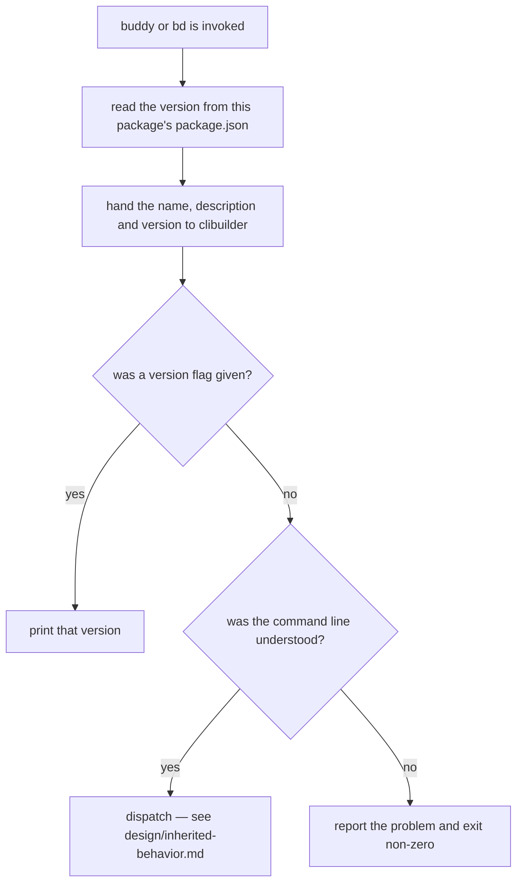

# CLI shell

## What

The program a user actually runs, considered apart from any single command. Installing the
`repobuddy` package puts two executables on the path — `buddy` and the shorter `bd` — and both start
the same program, reporting the version of the installed package.

This node is deliberately **small**. Almost everything the shell does once it starts — argument
parsing, help rendering, flag handling, the order in which it decides things — is clibuilder's, not
repobuddy's, and is recorded in [`../design/inherited-behavior.md`](../design/inherited-behavior.md)
rather than asserted here. What remains are the three things repobuddy genuinely promises and
genuinely wires: that both executables work, that the version reported is this package's version, and
that running the tool with no arguments is a usable thing to do.

**Non-goals.** How the command line is parsed, what help looks like, how `--silent` / `--verbose` /
`--debug-cli` behave, the wording of a rejection message, the specific non-zero code chosen, and the
order in which those decisions are taken — all clibuilder's mechanism. The behavior of any individual
command (their own capability nodes). The `package.json` `bin` mapping itself (`../tooling/`).

**A rejected command line fails loudly.** A command name or option the CLI does not recognize is
reported and exits with a **non-zero** code, so a script can tell a typo from success. This was
*not* true until recently — every rejection path exited 0 through clibuilder 10.0.0, and the spec
deliberately asserted nothing in either direction rather than pin a defect. It is fixed as of
clibuilder **10.1.0**, so the promise is now real and is asserted below.

The scenario asserts only that the code is **not zero** — not that it is `2`. The specific value is
clibuilder's choice, and pinning it would turn a harmless upstream change into a failure here.

## Use Cases

| Use case | Trigger | Inputs | Outcome |
|---|---|---|---|
| **Start the CLI** | The user runs `buddy` or `bd` | Optionally a command and arguments | The program starts and dispatches, or rejects an unusable command line |
| **Report the version** | `buddy --version` | — | The installed package's version is printed |

## Control Flow

repobuddy's own contribution to startup is small enough to state in one graph: it hands clibuilder a
name, a description, and the version it read from its own `package.json`, then lets clibuilder parse.

## Scenario map

### Start the CLI

| Edge | Path (Given) | Scenario |
|---|---|---|
| `A → invoked` | any — invoked through either executable name | `bd and buddy start the same program` |
| `E → yes` | no command named, so nothing is misunderstood | `running the CLI with no command prints usage rather than failing` |
| `E → no` | a command name that matches nothing registered | `an unrecognized command line exits with a non-zero code` |

### Report the version

| Edge | Path (Given) | Scenario |
|---|---|---|
| `D → yes` | the version flag given | `the version flag prints this package's version` |
