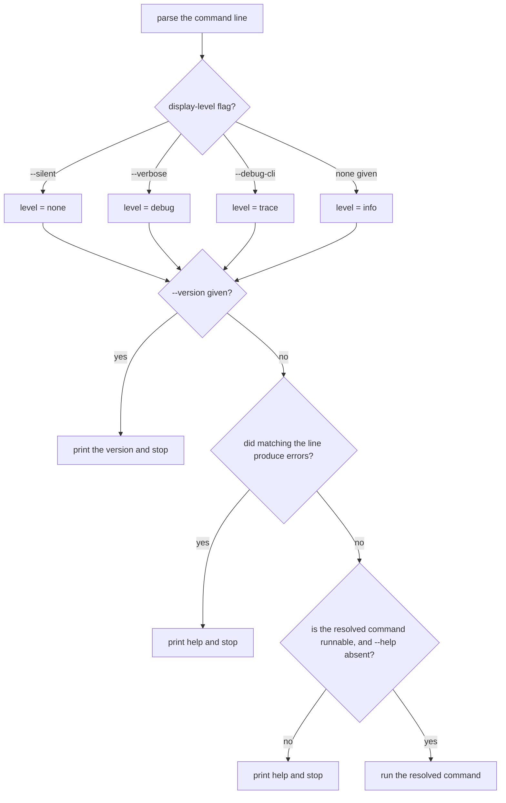

# CLI shell

## What

The program a user actually runs, considered apart from any single command. Installing the
`repobuddy` package puts two executables on the path — `buddy` and the shorter `bd` — and both start
the same program. Before any command runs, the shell decides what the user asked for: how much to
print, whether they wanted the version, whether what they typed was understood, and whether to show
help instead of doing the work.

All of this is *inherited behavior* — `clibuilder` supplies the parsing and the help rendering, and
no code in this package implements it. It is specified here regardless, because a consumer cannot
tell inherited behavior from authored behavior, and a `clibuilder` upgrade that changed it would be
a break in `repobuddy`.

The shell's decisions are **strictly ordered**, and the order is the part most likely to surprise:
the version flag is answered before the shell has decided whether the rest of the line even made
sense, so `buddy --version nonsense-command` prints a version rather than an error.

**Key terms.** *Resolved command* — the command the shell matched from what was typed, which is the
built-in base command when nothing was named. *Runnable* — a command that has work of its own to do,
as opposed to one that exists only to group subcommands (`plugins` groups `list` and `search`, and
does nothing by itself).

**Non-goals.** The behavior of any individual command — those belong to their own capability nodes;
validating the configuration file's contents, which the shell delegates (`configuration/`); how
commands contributed by plugins come to be registered (`plugin-management/plugin-contract/`); and the
`package.json` `bin` mapping that puts the executables on the path in the first place (`tooling/`).

## Use Cases

| Use case | Trigger | Inputs | Outcome |
|---|---|---|---|
| **Start the CLI** | The user runs `buddy` (or `bd`) | Optionally, a command and arguments | The shell parses the line and dispatches |
| **Report the version** | `buddy --version` (or `-v`) | — | The package version is printed; nothing else runs |
| **Show help** | `buddy --help` (or `-h`), or a command that cannot run | The resolved command | Help for that command is printed; the command does not run |
| **Dispatch a command** | `buddy <command> [args]` | A command name and its arguments | The command runs, or help is printed if the line was not understood |
| **Set the logging level** | Any invocation carrying `--silent`, `--verbose`, or `--debug-cli` | The flag | Output volume is set, and the flag is consumed rather than passed on |

## Control Flow

Every use case enters one graph — `clibuilder`'s `parse`. Configuration and plugin loading complete
before the first decision, so the plugins' commands are already registered by the time the line is
matched.

The three stopping edges — `C1`, `D1`, `E1` — are why an unusable command line never reaches a
command: the shell answers, prints, and stops rather than running anything with partial input.

**Open decision — the exit code on a rejected command line.** `clibuilder` exposes an `exit` function
on its context but never calls it, so today every one of the three stopping edges ends the process
with exit code **0**. A script running `buddy no-such-command` therefore cannot tell success from a
typo. No scenario above asserts an exit code, because asserting either value would settle this by
default. Settle it before this node freezes; if the answer is a non-zero code on `D1`, that is
authored behavior repobuddy has to add rather than inherited behavior it can rely on.

## Scenario map

### Start the CLI

| Edge | Path (Given) | Scenario |
|---|---|---|
| `E → run` | no command named, so the base command resolves | `running buddy with no command prints the help text` |
| `A → parse` | any — invoked through either executable name | `bd and buddy start the same program` |

### Report the version

| Edge | Path (Given) | Scenario |
|---|---|---|
| `C → yes` | version flag, nothing else on the line | `the version flag prints the package version and runs no command` |
| `C → yes` | version flag alongside a command name that does not exist | `the version flag is answered before the line is checked for errors` |
| `C → yes` | any — invoked by either spelling of the flag | `the long and short version flags print the same thing` |

### Show help

| Edge | Path (Given) | Scenario |
|---|---|---|
| `E → no` | a runnable command, invoked with the help flag | `the help flag prints help instead of running the command` |
| `E → no` | a command that only groups subcommands, invoked with no subcommand | `a command that only groups subcommands prints help` |

### Dispatch a command

| Edge | Path (Given) | Scenario |
|---|---|---|
| `E → run` | a runnable command named, with valid arguments | `a recognized command runs and receives its arguments` |
| `D → yes` | a command name that matches nothing registered | `an unrecognized command prints help` |
| `D → yes` | a recognized command carrying an option it does not define | `an unrecognized option prints help` |

### Set the logging level

| Edge | Path (Given) | Scenario |
|---|---|---|
| `B → --silent` | any invocation that would otherwise print an informational line | `the silent flag suppresses informational output` |
| `B → --verbose` | any invocation that emits a debug line | `the verbose flag shows debug output` |
| `B → --debug-cli` | any invocation, with clibuilder's own tracing available | `the debug-cli flag shows clibuilder's own trace output` |
| `B → none given` | an invocation carrying no display-level flag | `informational output is shown when no display-level flag is given` |
| `B → --silent` | a runnable command named alongside the flag | `a display-level flag is consumed rather than passed to the command` |
