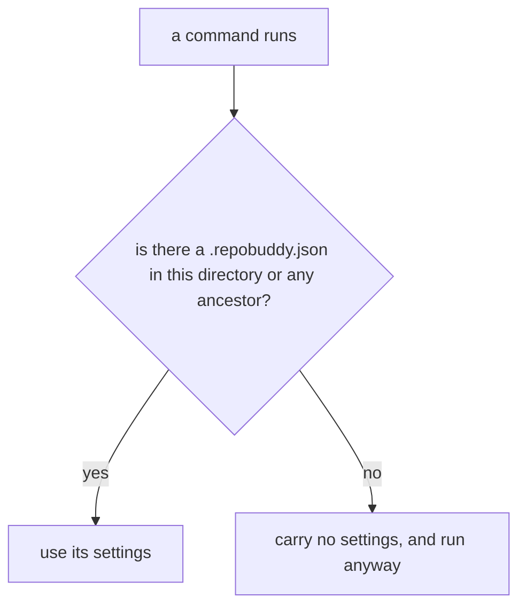

# Configuration

## What

Finding the repository's repobuddy settings. The settings record which plugins are active, and every
command that depends on the plugin list depends on this working.

repobuddy promises three things here, and only three:

1. **`.repobuddy.json` is the configuration file.** It is what the documentation names and what
   `init` writes. clibuilder accepts many other spellings and formats; repobuddy does not promise
   them.
2. **It is found from anywhere in the repository.** A command run three directories deep still picks
   up the settings at the repository root. This is what makes repobuddy usable in a monorepo.
3. **A repository with no configuration still works.** The tool does not require setup before it can
   be run.

Everything else — the full list of accepted names, the format detection order, the `package.json` key
fallback, and schema validation — is clibuilder machinery. It is documented in
[`../design/inherited-behavior.md`](../design/inherited-behavior.md) and asserted nowhere.

**Deliberately not specified: which file wins when two candidates exist.** clibuilder searches
name-first rather than directory-first, so a `repobuddy.json` at the repository root beats a
`.repobuddy.json` in the current directory. That is almost certainly an upstream bug, and pinning it
would turn the fix into a break here. Promise 2 above is stated in the weakest form that supports
what repobuddy needs, and holds under both the current and the corrected behavior.

**Non-goals.** Creating the configuration (`../initialization/`); changing which plugins it lists
(`../plugin-management/`); loading the plugins it names (`../plugin-management/loading/`); validating
its contents — repobuddy declares no schema, so nothing is validated.

## Use Cases

| Use case | Trigger | Inputs | Outcome |
|---|---|---|---|
| **Resolve the configuration** | Any command runs | The working directory | The repository's settings, or none |

## Control Flow

## Scenario map

### Resolve the configuration

| Edge | Path (Given) | Scenario |
|---|---|---|
| `B → yes` | the configuration sits in the working directory | `the documented configuration file is found` |
| `B → yes` | the configuration sits at the root, the command is run deeper | `the configuration is found from a subdirectory` |
| `B → no` | no configuration anywhere above the working directory | `a repository with no configuration still runs` |
