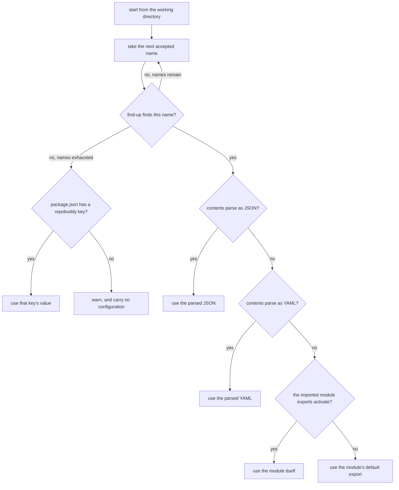
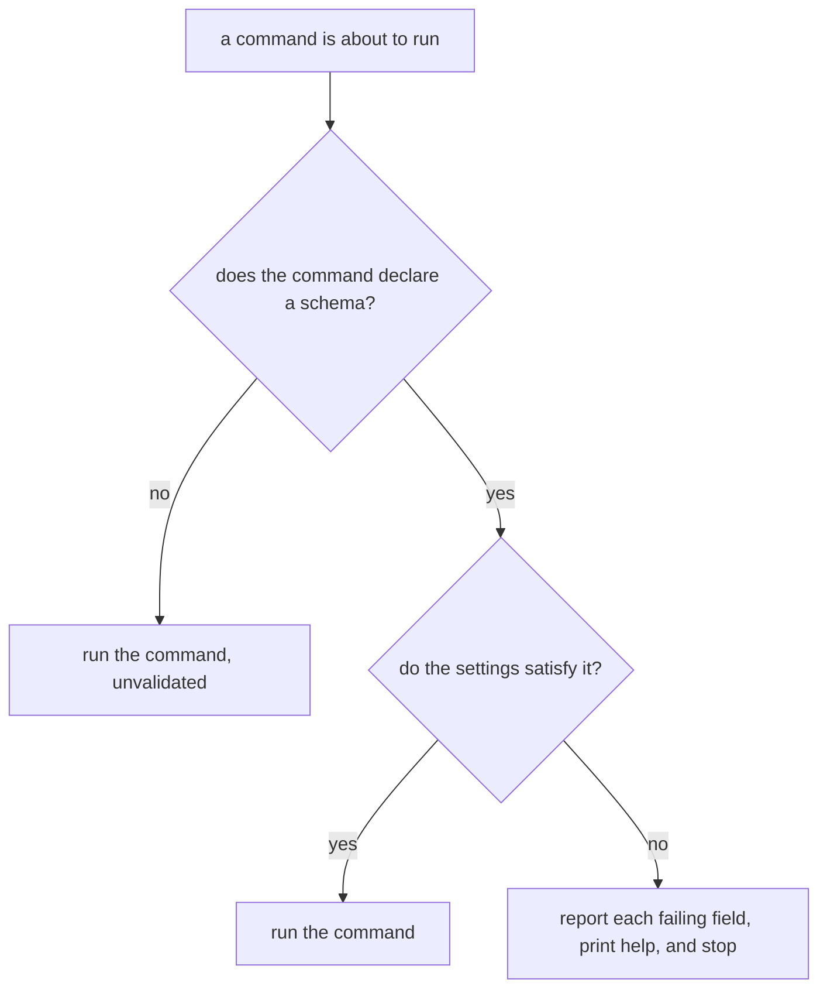

# Configuration

## What

Finding the repository's repobuddy settings and checking that what was found makes sense. The
settings record which plugins are active, and every command that depends on the plugin list depends
on this first.

The search is *find-up*: repobuddy looks in a directory, then its parent, then that parent's parent,
until it finds a match or runs out of directories. That is why a command run deep inside a repository
still picks up the settings at the repository root. Many file names are accepted — `.repobuddy.json`
is the one the documentation promises and the one `init` writes, but the undotted spelling, the
JavaScript and YAML variants, the `rc` family, and a `repobuddy` key inside `package.json` are all
resolved too.

**The search is by name first, not by directory first**, and this is the part most likely to
surprise. repobuddy takes the first accepted name, walks the whole directory chain looking for it,
and only moves to the next name if that one was never found. So a `repobuddy.json` at the repository
root beats a `.repobuddy.json` sitting in the directory the user is standing in — the *nearer* file
loses to the *earlier-named* one.

Resolution is *inherited behavior* from `clibuilder`, driven by the `name: 'repobuddy'` and
`config: true` options the app passes. Validation is **not** inherited in the same way: `clibuilder`
supplies the machinery, but the schema it enforces is repobuddy's to declare, and today repobuddy
declares none — so nothing is validated.

**Key terms.** *Accepted name* — one of the file names repobuddy will recognize as its configuration.
*find-up* — searching a directory and then each parent in turn. *Schema* — the declared shape a
configuration must have, against which a command validates it.

**Non-goals.** Creating the configuration file (`initialization/`); changing which plugins it lists
(`plugin-management/`); and loading the plugins it names, which `clibuilder` does automatically once
the file is resolved.

## Use Cases

| Use case | Trigger | Inputs | Outcome |
|---|---|---|---|
| **Locate the configuration** | Any command runs | The working directory and the app name `repobuddy` | The path of the configuration to use, or nothing |
| **Read the configuration** | A configuration file was located | The file's contents | The settings as data |
| **Validate the configuration** | A command declaring a schema is about to run | The loaded settings and the command's schema | The command proceeds, or it is stopped and the offending field named |

## Control Flow

### Locate and read

The `C -->|no, names remain| B` loop is what makes the search name-first: the whole directory chain
is walked once per name, rather than every name being tried once per directory.

### Validate

## Scenario map

### Locate the configuration

| Edge | Path (Given) | Scenario |
|---|---|---|
| `C → yes` | the configuration sits in the working directory | `a configuration file in the working directory is found` |
| `C → yes` | the configuration sits in an ancestor of the working directory | `a configuration file in a parent directory is found` |
| `C → yes` | two accepted names exist, the earlier-named one further away | `an earlier accepted name beats a nearer file` |
| `P → yes` | no accepted file anywhere, but package.json carries the key | `the repobuddy key in package.json is used when no file exists` |
| `P → no` | no accepted file and no key in package.json | `no configuration anywhere warns and carries no settings` |

### Read the configuration

| Edge | Path (Given) | Scenario |
|---|---|---|
| `D → yes` | the located file holds JSON | `a JSON configuration is read` |
| `E → yes` | the located file holds YAML | `a YAML configuration is read` |
| `F → no` | the located file is a module with a default export | `a JavaScript configuration is read from its default export` |
| `F → yes` | the located file is a module exporting activate | `a JavaScript configuration exporting activate is used whole` |

### Validate the configuration

| Edge | Path (Given) | Scenario |
|---|---|---|
| `H → no` | the command declares no schema | `a command declaring no schema runs without validation` |
| `I → yes` | the command declares a schema the settings satisfy | `settings matching the schema let the command run` |
| `I → no` | the command declares a schema the settings violate | `settings violating the schema stop the command and name the field` |
