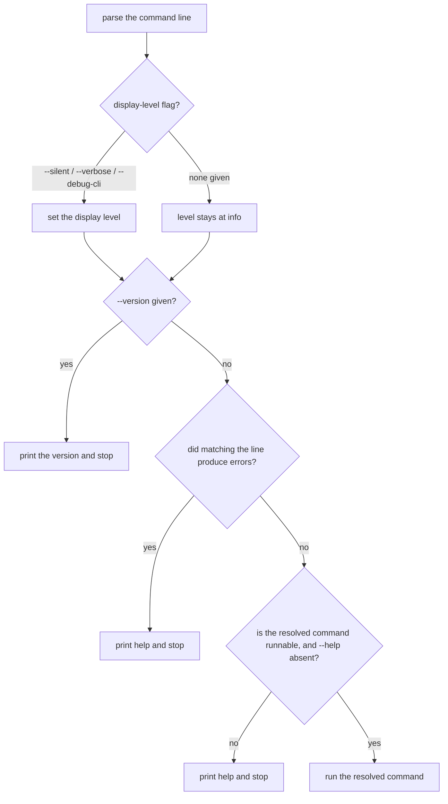

# Inherited behavior

repobuddy is a thin shell over [`clibuilder`](https://www.npmjs.com/package/clibuilder). A large part
of what a user experiences — argument parsing, configuration resolution, help rendering, plugin
loading — is implemented by clibuilder, not by any code in this package.

This document records what we understand about that behavior, which parts of it our own promises rest
on, and the rule for deciding what belongs in a capability node's suite. It is descriptive: nothing
here is tested directly, and no scenario in this spec asserts clibuilder's mechanics.

## The rule

**Specify your promise, not their mechanism.**

"A broken plugin doesn't take the whole CLI down" is a promise *repobuddy* makes. clibuilder happens
to implement it, but if it stopped being true, repobuddy would be broken and a user would rightly
file the bug here. That belongs in a suite.

"The output contains `not a valid plugin`" is clibuilder's wording. repobuddy never promised it, and
freezing it would make a cosmetic change upstream into a failure here. That does not belong in a
suite.

### The corollary: assert the weakest form that supports the promise

An over-specific assertion pins the dependency's *accidents* — including its bugs — and turns a fix
into a break. The config-resolution case below is the worked example, and the reason this rule is
written down rather than left to taste.

## Assumptions register

The clibuilder facts our own promises rest on. Each should be guarded by a `*.learn.ts` boundary test
(a **learning test** — see [Naming](#naming)), so that a clibuilder upgrade fails a Renovate PR
rather than failing a user.

| # | Assumption | What breaks without it |
|---|---|---|
| 1 | find-up resolves the configuration from a subdirectory | `workflows` — running a plugin command from anywhere in the repo |
| 2 | packages named in `config.plugins` are imported and activated automatically | `add`, `initialization`, `workflows` — the entire point of listing a plugin |
| 3 | a plugin that fails to import or exports no `activate` is reported and skipped, and the others still load | `loading` — one bad entry costing that plugin rather than the tool |
| 4 | `keywords` defaults to the app's own name when configuration is enabled | `initialization` plugin detection, and `discovery` |
| 5 | the `plugins` command is added automatically when configuration is enabled | `discovery` — the command exists at all |
| 6 | the plugin contract is a `activate` export called with a context carrying `addCommand` | `plugin-contract`, and any plugin this project ships |

Six guards, not one per inherited behavior. An assumption earns a guard by supporting a promise, not
by being interesting.

## What we know about the mechanics

Preserved from reading clibuilder v9's source. Useful for debugging and for judging future upgrades —
**not** a contract, and deliberately not asserted anywhere.

### The shell's decision order (`builder.ts` → `parse`)



Notable: the version flag is answered **before** the line is checked for errors, so
`buddy --version no-such-command` prints a version rather than an error.

Also notable: **every rejection path exits 0.** clibuilder builds a `context.exit` and never calls
it, so a script cannot distinguish `buddy no-such-command` from success. There are two rejection
sites, not three — `lookupCommand` folds unknown-command and bad-option into one errors array
reaching one `showHelp` branch, and configuration validation is the other. Both sit inside
clibuilder; nothing in this package can fix it without reimplementing the decision that was just
made. **Raise upstream rather than working around it here.**

### Configuration resolution (`config.ts` → `loadConfig`)

Accepted names are generated from the app name — the bare name, then `.cjs`, `.mjs`, `.js`, `.json`,
`.yml`, `.yaml`, the `rc` family — each in both undotted and dotted spellings. If no file matches
anywhere up the tree, a `repobuddy` key in `package.json` is used. Contents are parsed as JSON, then
YAML, then imported as a module.

**The search is name-first, not directory-first** — and this is the trap:

```js
for (const filename of filenames) {
    const filePath = findUpSync(filename, { cwd })
    if (filePath) return filePath
}
```

The whole directory chain is walked once **per name**, rather than every name being tried once per
directory. Because `repobuddy.json` sorts before `.repobuddy.json`, a `repobuddy.json` at the
repository root beats a `.repobuddy.json` in the directory you are standing in. Verified empirically
against the real `loadConfig`, not only read.

> **Do not pin this.** It is almost certainly a clibuilder bug — every comparable tool resolves
> nearest-first. An earlier draft of this spec asserted it as intended behavior; had that frozen,
> *fixing* it upstream would have become a breaking change here. Assumption 1 above is deliberately
> stated in its weakest useful form ("resolves from a subdirectory"), which holds under both the
> current behavior and the corrected behavior.

### Plugin loading (`plugins.ts`)

Every listed plugin is imported concurrently before the command line is matched. A failed import is
warned about and yields nothing, which then also fails the validity check — so an unimportable plugin
produces **two** warnings. Validity is literally `m && typeof m.activate === 'function'`. `activate`
is called with `{ addCommand }` and its return value is discarded.

Plugins are imported by **bare package name, resolved from clibuilder's own location** — the
repository's working directory is passed along but used only in the error message.

### Spike result: pnpm resolution (2026-08-12)

This was flagged as the highest risk in the spec, on the theory that a pnpm layout would hide a
genuinely installed plugin from clibuilder. **The risk did not reproduce.** Plugin loading succeeded
end-to-end in every layout constructed:

| Layout | Plugin | Result |
|---|---|---|
| single package, pnpm defaults | local `file:` dep | loads |
| single package, `hoist=false` | local `file:` dep | loads |
| workspace, package depends on sibling | `workspace:*` link | loads |
| workspace, package depends on registry | real `@repobuddy/typescript` | loads (`ts` command appears) |

**The mechanism** is that pnpm's hidden hoist directory sits *inside* the walk-up chain. clibuilder's
real path is `<root>/node_modules/.pnpm/clibuilder@9.1.0/node_modules/clibuilder`, so Node's search
for a bare specifier walks up through `<root>/node_modules/.pnpm/node_modules/` — which pnpm
populates with symlinks to every installed package — before reaching `<root>/node_modules/`.
Confirmed directly: resolving `@repobuddy/typescript` from clibuilder's own directory *finds* the
package (it fails only later, on `require` conditions the ESM-only package does not provide).

**Two honest limits on this result:**

- Attempts to disable hoisting did not take effect (`pnpm config get hoist-pattern` returned
  `undefined`), so a genuinely un-hoisted layout was **not** tested. The conclusion is "not
  reproduced in realistic layouts", not "proven impossible".
- **Global installation is untested and remains a real risk.** Installed globally, clibuilder would
  live in a global store with no path back to the project's `node_modules`, and a locally installed
  plugin should not resolve. The readme documents `npm install -D repobuddy` — a local dev
  dependency — and that documented path is the one shown to work. Treat local installation as a
  requirement rather than a preference until tested.

## Naming

A **learning test** (Robert C. Martin, *Clean Code* ch. 8, "Boundaries") is a test written against a
third-party package, kept, and re-run on upgrade to detect behavioral drift. It is distinct from a
**characterization test** (Feathers, *Working Effectively with Legacy Code*), which pins down code you
*own* but do not understand so that you can safely change it. Same technique, opposite sides of the
boundary: characterization tests enable your change, learning tests detect theirs.

Guards live beside the source as `*.learn.ts`. The `files` allowlist in `package.json` already
excludes a taxonomy of test kinds (`spec`, `test`, `unit`, `accept`, `integrate`, `system`, `perf`,
`stress`); **`learn` needs adding to it** so guards are not published.
