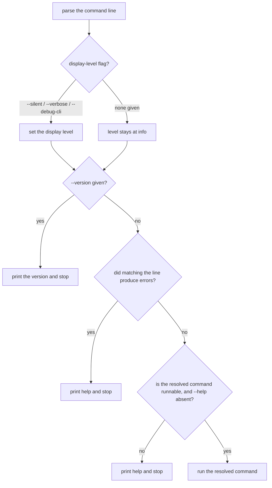

# Inherited behavior

repobuddy is a thin shell over [`clibuilder`](https://www.npmjs.com/package/clibuilder). A large part
of what a user experiences — argument parsing, configuration resolution, help rendering, plugin
loading — is implemented by clibuilder, not by any code in this package.

This document records what we understand about that behavior, which parts of it our own promises rest
on, and the rule for deciding what belongs in a capability node's suite. It is descriptive: nothing
here is tested directly, and no scenario in this spec asserts a dependency's mechanics.

The rule below was written for clibuilder, but it is **not clibuilder-specific** — it governs every
dependency whose behavior a user experiences as ours. It has since been applied to
`find-installed-packages` (assumption 7) and to `package-manager-detector` (assumption 8, adopted
deliberately in [ADR 0001](./decisions/0001-delegate-package-manager-detection.md)).

## The rule

**Specify your promise, not their mechanism.**

"A broken plugin doesn't take the whole CLI down" is a promise *repobuddy* makes. clibuilder happens
to implement it, but if it stopped being true, repobuddy would be broken and a user would rightly
file the bug here. That belongs in a suite.

"The output contains `not a valid plugin`" is clibuilder's wording. repobuddy never promised it, and
freezing it would make a cosmetic change upstream into a failure here. That does not belong in a
suite.

### The corollary: assert the weakest form that supports the promise

An over-specific assertion pins the dependency's *accidents* — including its bugs — and turns a fix
into a break. The config-resolution case below is the worked example, and the reason this rule is
written down rather than left to taste.

## Assumptions register

The clibuilder facts our own promises rest on. Each should be guarded by a `*.learn.ts` boundary test
(a **learning test** — see [Naming](#naming)), so that a clibuilder upgrade fails a Renovate PR
rather than failing a user.

| # | Assumption | What breaks without it |
|---|---|---|
| 1 | find-up resolves the configuration from a subdirectory | `workflows` — running a plugin command from anywhere in the repo |
| 2 | packages named in `config.plugins` are imported and activated automatically | `add`, `initialization`, `workflows` — the entire point of listing a plugin |
| 3 | a plugin that fails to import or exports no `activate` is reported and skipped, and the others still load | `loading` — one bad entry costing that plugin rather than the tool |
| 4 | `keywords` defaults to the app's own name when configuration is enabled | `initialization` plugin detection, and `discovery` |
| 5 | the `plugins` command is added automatically when configuration is enabled | `discovery` — the command exists at all |
| 6 | the plugin contract is a `activate` export called with a context carrying `addCommand` | `plugin-contract`, and any plugin this project ships |
| 7 | installed-plugin detection finds packages in this repo's package layout (pnpm workspace) **when run from the package root** | `initialization` detection, and `discovery` list |
| 8 | the package-manager detector resolves the repository's tool (declared field over lockfile over npm) and builds the right command for it | `package-manager`, and `add` / `remove` / `update` through it |
| 9 | a rejected command line exits non-zero (clibuilder >= 10.1.0) | `cli-shell` — a script being able to detect a typo |

Nine guards, not one per inherited behavior. An assumption earns a guard by supporting a promise,
not by being interesting.

### Why assumption 7 exists, and why it is the strongest argument for this register

Assumptions 1–6 are clibuilder's own behavior. Assumption 7 is not: package detection is performed by
`find-installed-packages`, a **transitive** dependency reached through clibuilder, and scanning a pnpm
layout is exactly the kind of thing that changes between its releases.

That matters because of how it would reach us. Renovate watches this package's **direct**
dependencies; a behavioral change in a transitive dependency arrives silently, through a clibuilder
release or an ordinary lockfile refresh, with no PR title mentioning it. **A learning test is the only
thing in the pipeline that would notice.**

This is not hypothetical. As of 2026-08-12, `find-installed-packages` had just published 3.2.0 and
`search-packages` 2.2.1, neither yet pulled — 3.2.0 is inside the 24-hour `minimumreleaseage` hold in
the repo's `.npmrc`. Detection was verified working against **3.1.2** in a pnpm workspace
(`plugins list` found `@repobuddy/typescript` by keyword), so nothing is broken today. **Re-verify
after the upgrade lands**, and let the guard carry it from then on.

### Detection does not walk up — config resolution does

A behavioral asymmetry worth knowing, because it is easy to assume both work the same way:

| | Walks up the directory tree? |
|---|---|
| **Configuration resolution** (find-up) | **Yes** — a config at the repo root is found from any depth |
| **Installed-plugin detection** (`find-installed-packages`) | **No** — it scans relative to the working directory |

Verified 2026-08-12: from a package root, `plugins list` reports `@repobuddy/typescript`; from
`sub/deep` two levels down, the same command reports *nothing* — while the configuration still
resolves correctly from that same directory. Confirmed identical on clibuilder 9 and 10, so this is
**long-standing behavior, not a regression**.

**The consequence lands on `init`.** Run `buddy init` from a subdirectory and it detects no plugins,
writing an empty list even in a repository that has them. The merge-don't-overwrite decision
(`../initialization/`) contains the damage — a re-run from the package root fills the list in, and
nothing is destroyed — but a *first* `init` from the wrong directory produces a silently useless
result. `init` should either resolve to the package root before detecting, or say plainly that it
detected nothing and where it looked.

## Verification against clibuilder 10 (2026-08-12)

The mechanics above were originally read from v9's source. The dependency has since been moved to
`^10.0.0`; every assumption in the register was re-checked against it.

| Assumption | v10 |
|---|---|
| 1 — config resolves from a subdirectory | holds |
| 2 — listed plugins auto-load | holds (`ts` command present) |
| 3 — a broken plugin is reported and skipped, others load | holds (two warnings, `ts` still loaded) |
| 4 — keywords default to the app name | holds |
| 5 — the `plugins` command is added automatically | holds |
| 6 — the plugin contract is `activate` + `addCommand` | holds |
| 7 — detection finds installed plugins from the package root | holds |

`pnpm --filter repobuddy build` also passes against v10.

**Still not fixed in v10: every rejection path exits 0.** Re-checked directly — `no-such-command`
still exits `0`. The upstream issue stands, and no scenario here asserts an exit code in either
direction.

## What we know about the mechanics

Preserved from reading clibuilder v9's source. Useful for debugging and for judging future upgrades —
**not** a contract, and deliberately not asserted anywhere.

### The shell's decision order (`builder.ts` → `parse`)



Notable: the version flag is answered **before** the line is checked for errors, so
`buddy --version no-such-command` prints a version rather than an error.

**The exit-code defect — fixed in 10.1.0.** Through clibuilder 10.0.0, *every* rejection path exited
`0`: `context.exit` was built and never called, so a script could not distinguish
`buddy no-such-command` from success. There were two rejection sites, not three — `lookupCommand`
folds unknown-command and bad-option into one errors array reaching one `showHelp` branch, and
configuration validation is the other.

It is now fixed. Verified 2026-08-12 with identical probes:

| clibuilder | unknown command | bad option | success |
|---|---|---|---|
| 10.0.0 | `0` | `0` | `0` |
| **10.1.0** | `2` | `2` | `0` |

The message improved too — `unexpected argument: no-such-command` rather than bare help. This is the
second upstream defect recorded here that was fixed within days of being written down, and the second
time declining to pin it was what let the fix land without breaking the spec.

`cli-shell` now asserts a **non-zero** exit on a rejected command line — deliberately not `2`, since
the specific value is clibuilder's to choose.

### Configuration resolution (`config.ts` → `loadConfig`)

Accepted names are generated from the app name — the bare name, then `.cjs`, `.mjs`, `.js`, `.json`,
`.yml`, `.yaml`, the `rc` family — each in both undotted and dotted spellings. If no file matches
anywhere up the tree, a `repobuddy` key in `package.json` is used. Contents are parsed as JSON, then
YAML, then imported as a module.

### The precedence bug — and why not pinning it paid off

In **clibuilder 9.0.0** the search was **name-first, not directory-first**:

```js
for (const filename of filenames) {
    const filePath = findUpSync(filename, { cwd })
    if (filePath) return filePath
}
```

The whole directory chain was walked once *per name* rather than every name once per directory, so
because `repobuddy.json` sorts before `.repobuddy.json`, a `repobuddy.json` at the repository root
beat a `.repobuddy.json` in the directory you were standing in.

**It is fixed.** Bisected 2026-08-12 with identical fixtures (`prec/repobuddy.json` = ROOT,
`prec/sub/.repobuddy.json` = SUB, cwd = `prec/sub`):

| clibuilder | winner |
|---|---|
| 9.0.0 | `ROOT-undotted` — name-first |
| **9.1.0** | `SUB-dotted` — nearest-first |
| 9.2.0, 10.1.0 | `SUB-dotted` |

> **The lesson, and it is sharper than expected.** An early draft of this spec asserted name-first as
> intended behavior. Had it frozen, the upstream *fix* would have become a failing scenario here.
>
> And the fix did not arrive in the major, where someone would be reading release notes — it shipped
> in **9.1.0, a minor**, which under our `^9.0.0` range lands automatically on any routine lockfile
> refresh. The accident we declined to pin was corrected by the least-scrutinized kind of update
> there is. Assumption 1 is stated in its weakest useful form ("resolves from a subdirectory"), which
> held true across every version above.

### Plugin loading (`plugins.ts`)

Every listed plugin is imported concurrently before the command line is matched. A failed import is
warned about and yields nothing, which then also fails the validity check — so an unimportable plugin
produces **two** warnings. Validity is literally `m && typeof m.activate === 'function'`. `activate`
is called with `{ addCommand }` and its return value is discarded.

Plugins are imported by **bare package name, resolved from clibuilder's own location** — the
repository's working directory is passed along but used only in the error message.

### Spike result: pnpm resolution (2026-08-12)

This was flagged as the highest risk in the spec, on the theory that a pnpm layout would hide a
genuinely installed plugin from clibuilder. **The risk did not reproduce.** Plugin loading succeeded
end-to-end in every layout constructed:

| Layout | Plugin | Result |
|---|---|---|
| single package, pnpm defaults | local `file:` dep | loads |
| single package, `hoist=false` | local `file:` dep | loads |
| workspace, package depends on sibling | `workspace:*` link | loads |
| workspace, package depends on registry | real `@repobuddy/typescript` | loads (`ts` command appears) |

**The mechanism** is that pnpm's hidden hoist directory sits *inside* the walk-up chain. clibuilder's
real path is `<root>/node_modules/.pnpm/clibuilder@9.1.0/node_modules/clibuilder`, so Node's search
for a bare specifier walks up through `<root>/node_modules/.pnpm/node_modules/` — which pnpm
populates with symlinks to every installed package — before reaching `<root>/node_modules/`.
Confirmed directly: resolving `@repobuddy/typescript` from clibuilder's own directory *finds* the
package (it fails only later, on `require` conditions the ESM-only package does not provide).

**Two honest limits on this result:**

- Attempts to disable hoisting did not take effect (`pnpm config get hoist-pattern` returned
  `undefined`), so a genuinely un-hoisted layout was **not** tested. The conclusion is "not
  reproduced in realistic layouts", not "proven impossible".
- **Global installation is untested and remains a real risk.** Installed globally, clibuilder would
  live in a global store with no path back to the project's `node_modules`, and a locally installed
  plugin should not resolve. The readme documents `npm install -D repobuddy` — a local dev
  dependency — and that documented path is the one shown to work. Treat local installation as a
  requirement rather than a preference until tested.

## Naming

A **learning test** (Robert C. Martin, *Clean Code* ch. 8, "Boundaries") is a test written against a
third-party package, kept, and re-run on upgrade to detect behavioral drift. It is distinct from a
**characterization test** (Feathers, *Working Effectively with Legacy Code*), which pins down code you
*own* but do not understand so that you can safely change it. Same technique, opposite sides of the
boundary: characterization tests enable your change, learning tests detect theirs.

Guards live beside the source as `*.learn.ts`. The `files` allowlist in `package.json` already
excludes a taxonomy of test kinds (`spec`, `test`, `unit`, `accept`, `integrate`, `system`, `perf`,
`stress`); **`learn` needs adding to it** so guards are not published.
