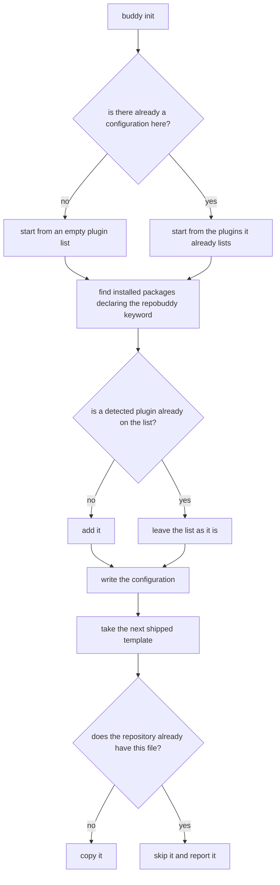

# Initialization

## What

`buddy init` — setting a repository up to use repobuddy. It does three things in one command:

1. **Writes the configuration file** — `.repobuddy.json` in the current directory.
2. **Detects plugins already installed** — finds the installed packages that declare the `repobuddy`
   keyword and lists them, so a repository already depending on `@repobuddy/typescript` gets a
   working configuration rather than an empty one. This is the same lookup `plugins list` uses, so
   the two can never disagree about what counts as an installed plugin.
3. **Copies template files** — the starter files shipped in the package's `templates/` directory
   (`.editorconfig` today) into the repository.

It is **safe to repeat** (idempotent): running it again merges into what is already there instead of
overwriting or failing. That is what makes `init` useful for picking up newly installed plugins, not
only for first-time setup.

**A file the repository already has is never touched.** When a template already exists, `init` skips
it and says so. There is no `--force` and no prompting — deliberately. Reconciling a template against
a repository's own edits is a diff-and-merge problem, and that job belongs to a future agentic plugin
that can do it properly. `init` stays non-destructive rather than growing half a merge story.

**Non-goals.** Installing anything — `init` records and copies, it never adds a dependency (that is
`../plugin-management/add/`); reading or validating an existing configuration (`../configuration/`);
and merging a template into a file the repository has already customized, per the paragraph above.

## Use Cases

| Use case | Trigger | Inputs | Outcome |
|---|---|---|---|
| **Initialize the repository** | `buddy init` | The working directory, its installed packages, and the shipped templates | A configuration listing the detected plugins, and the templates the repository did not already have |

## Control Flow

The two merge points — `C2` preserving an existing list, and `E2` declining to re-add — are what make
the command safe to repeat. Neither writes anything the second run would have to undo.

## Scenario map

### Initialize the repository

| Edge | Path (Given) | Scenario |
|---|---|---|
| `B → no` | a repository with no configuration file | `init creates a configuration where there was none` |
| `B → yes` | a configuration already listing a plugin | `init keeps the plugins an existing configuration lists` |
| `E → no` | an installed plugin that the configuration does not list | `an installed plugin missing from the configuration is added` |
| `E → yes` | an installed plugin the configuration already lists | `an installed plugin already listed is not added twice` |
| `D → find` | a repository where nothing installed declares the keyword | `init writes an empty plugin list when nothing is installed` |
| `H → no` | a repository lacking one of the shipped templates | `a template the repository lacks is copied` |
| `H → yes` | a repository whose copy of a template differs from the shipped one | `a template the repository already has is skipped and left alone` |
| `A → init` | any — the command run a second time | `running init twice leaves the same configuration` |
