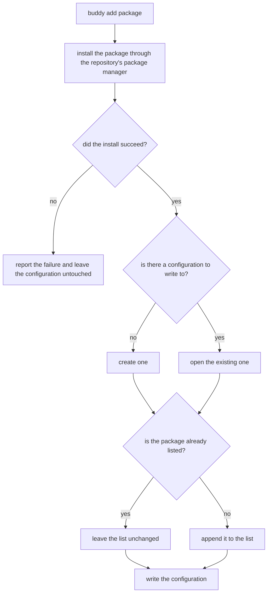

# Add a plugin

## What

`buddy add <package>` — obtain a plugin and switch it on, in one command. It **installs** the named
package as a dependency through the repository's own package manager
([`../package-manager/`](../package-manager/README.md)), and then **records** it in the
configuration's `plugins` list so it loads on the next run. Both halves, not one: installing without
recording leaves the commands unavailable, and recording without installing leaves a configuration
pointing at nothing.

**Install first, record second.** The order is deliberate. If the install fails, nothing is written,
so a repository never ends up listing a plugin it does not have. The reverse order would need an
undo step for exactly the case that is most likely to go wrong.

**The package name is taken literally.** `buddy add typescript` installs the package named
`typescript`. There is no shorthand expanding a bare name to `@repobuddy/typescript` — a plugin from
any scope, or none, is added the same way. (The readme currently promises the opposite; correcting it
is part of this project's work.)

**Key terms.** *Listed* — named in the configuration's `plugins` array, which is what makes a plugin
load. *Installed* — present as a dependency of the repository. `add` does both; they are separate
states and the sibling units change them separately.

**Non-goals.** Removing or upgrading a plugin (sibling units); finding out which plugins exist
(`../discovery/`); detecting plugins during first-time setup (`../../initialization/`); and choosing
or running the package manager, which is delegated (`../package-manager/`).

## Use Cases

| Use case | Trigger | Inputs | Outcome |
|---|---|---|---|
| **Add a plugin** | `buddy add <package>` | A package name | The package is installed and listed, or the failure is reported and nothing is listed |

## Control Flow

## Scenario map

### Add a plugin

| Edge | Path (Given) | Scenario |
|---|---|---|
| `E → no` | a configuration that does not list the package | `adding a plugin installs it and lists it` |
| `E → yes` | a configuration that already lists the package | `adding a plugin already listed does not list it twice` |
| `C → no` | the package manager rejects the install | `a failed install lists nothing` |
| `D → no` | a repository with no configuration file | `adding a plugin to an uninitialized repository creates the configuration` |
| `A → install` | a bare name that is not a published package on its own | `a bare name is installed literally rather than expanded` |
