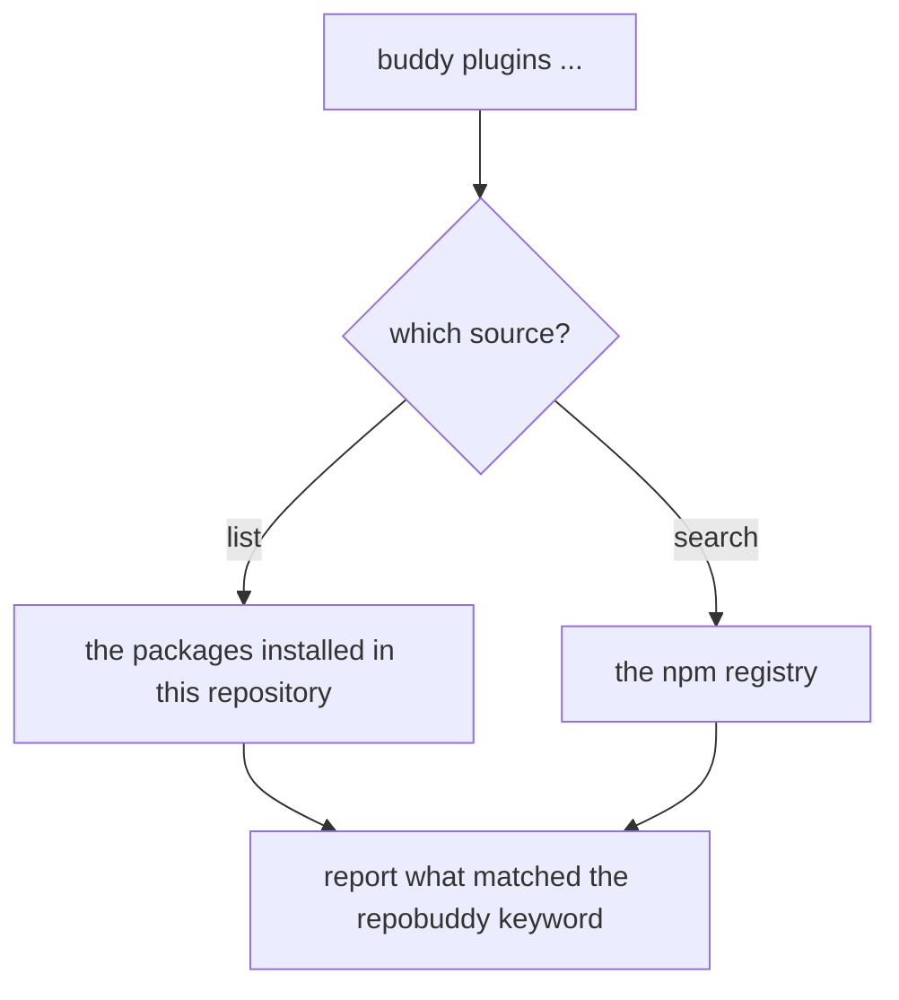

# Plugin discovery

## What

The `plugins` command — seeing which plugins this repository has, and finding ones it could have.

- **`plugins list`** reports the plugins **installed** in this repository.
- **`plugins search`** queries the **npm registry** for plugins that could be installed.

Both exist because they answer different questions from different sources. That distinction is
repobuddy's promise. How the results are worded, how the command counts them, and the fact that the
command exists at all without repobuddy registering it are clibuilder's — see
[`../../design/inherited-behavior.md`](../../design/inherited-behavior.md).

Plugins are matched by npm keyword. repobuddy passes no explicit `keywords` option and does not need
to: clibuilder defaults the list to the app's own name, so the keyword is `repobuddy`, and
`@repobuddy/typescript` declares it. That default is [assumption 4] in the design note and is guarded
by a boundary test rather than asserted here.

**Non-goals.** Acting on a discovered plugin — installing, activating, removing, or updating one
belongs to the sibling units. The exact wording and grouping of the output, and the `ls` alias, which
are clibuilder's. Printing help when `plugins` is run bare (`../../cli-shell/`).

## Use Cases

| Use case | Trigger | Inputs | Outcome |
|---|---|---|---|
| **List installed plugins** | `buddy plugins list` | The repository's installed packages | The installed plugins are reported |
| **Search for available plugins** | `buddy plugins search` | The npm registry | The matching packages are reported |

## Control Flow

## Scenario map

### List installed plugins

| Edge | Path (Given) | Scenario |
|---|---|---|
| `B → list` | one installed package declares the keyword | `listing reports an installed plugin` |

### Search for available plugins

| Edge | Path (Given) | Scenario |
|---|---|---|
| `B → search` | the registry has a package declaring the keyword | `searching reports a package from the registry` |
