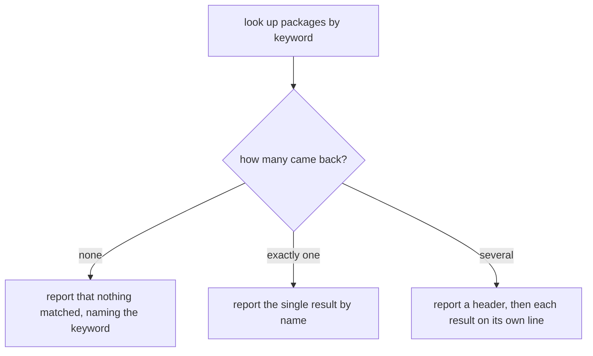

# Plugin discovery

## What

The `plugins` command — seeing which plugins this repository already has, and finding ones it could
have. `clibuilder` adds this command automatically because the app enables configuration, so it
already works today; no code in this package implements it.

The two subcommands look in different places, and that difference is the reason both exist:

- **`plugins list`** (also spelled `ls`) reports the plugins **installed** in this repository.
- **`plugins search`** queries the **npm registry** for plugins that could be installed.

Both find plugins by npm keyword. The app passes no `keywords` option, but that does not leave the
lookup matchless: `clibuilder` defaults the keyword list to the app's own name whenever configuration
is enabled, so repobuddy looks for the keyword `repobuddy`. `@repobuddy/typescript` declares that
keyword, so it is already discoverable.

Both subcommands report the same three ways depending on how many results came back — none, exactly
one, or several — with the wording differing only in whether it says "plugin" or "package".

**Non-goals.** Acting on a discovered plugin — installing, activating, removing, or updating one
belongs to the sibling units. Printing help when `plugins` is run with no subcommand, which is the
shell's decision (`../../cli-shell/`).

**Open decision.** The keyword list is currently inherited by default rather than declared. Whether
to keep relying on that default or to pass an explicit `keywords` option is a legibility call, not a
defect — the behavior is the same either way today. Settle before this node freezes.

## Use Cases

| Use case | Trigger | Inputs | Outcome |
|---|---|---|---|
| **List installed plugins** | `buddy plugins list` or `buddy plugins ls` | The keyword to match | The installed plugins are reported and returned |
| **Search for available plugins** | `buddy plugins search` | The keyword to match | The matching registry packages are reported |

## Control Flow

Both subcommands run the same shape over different sources, so they share one graph. The source and
the noun in the wording are what differ.

## Scenario map

### List installed plugins

| Edge | Path (Given) | Scenario |
|---|---|---|
| `B → none` | no installed package declares the keyword | `listing with nothing installed names the keyword searched for` |
| `B → exactly one` | one installed package declares the keyword | `listing one installed plugin reports it by name` |
| `B → several` | two installed packages declare the keyword | `listing several installed plugins reports each on its own line` |
| `A → look up` | any — invoked by either spelling of the subcommand | `ls is accepted as another spelling of list` |

### Search for available plugins

| Edge | Path (Given) | Scenario |
|---|---|---|
| `B → none` | the registry returns nothing for the keyword | `searching with no matches names the keyword searched for` |
| `B → exactly one` | the registry returns one package | `searching with one match reports it by name` |
| `B → several` | the registry returns two packages | `searching with several matches reports each on its own line` |
