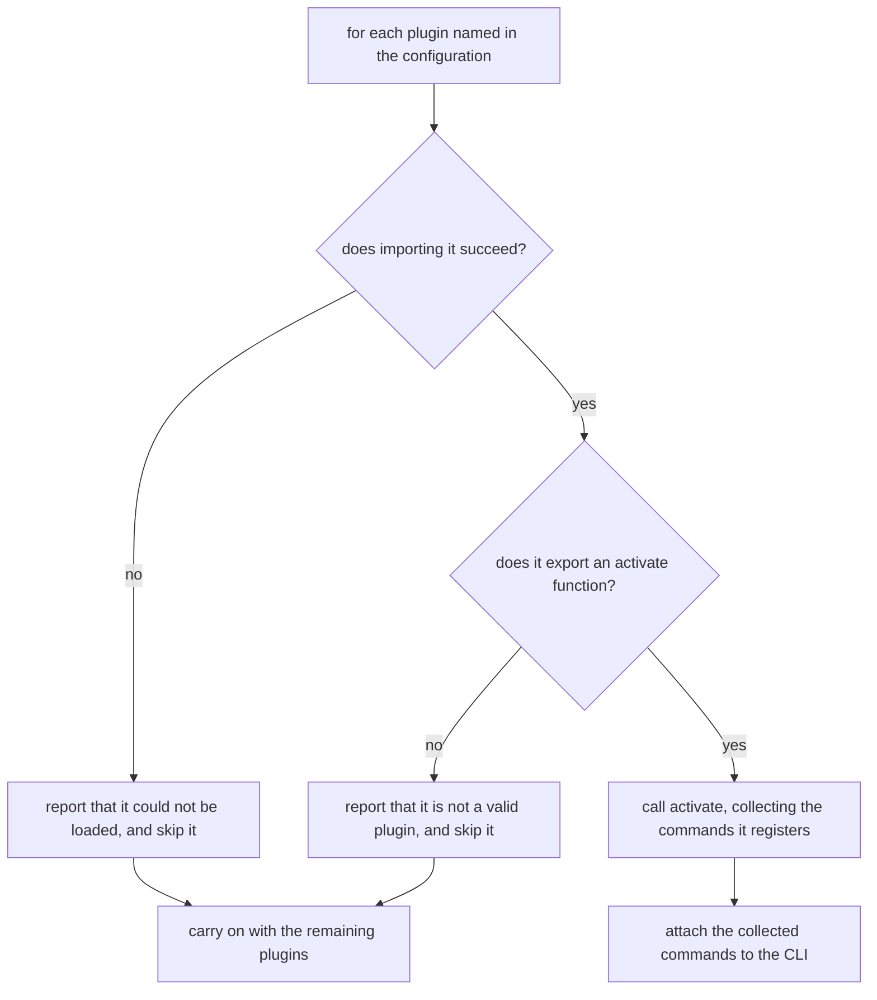

# Plugin loading

## What

What repobuddy does at startup with each plugin the configuration names — and, just as importantly,
what it does when one of them is broken.

Every plugin in the configuration's `plugins` list is imported and activated before the command line
is matched, so the plugins' commands are already registered by the time the user's command is looked
up. Loading happens for all of them together rather than one at a time, so one slow plugin does not
serialize the rest.

The governing decision is that **a broken plugin is survivable**. A plugin that cannot be imported,
or that loads but does not export `activate`, is reported and skipped — the CLI carries on and every
other plugin still loads. A single bad entry in the configuration therefore costs the user that
plugin's commands, not the whole tool.

The interface a plugin implements is [`../plugin-contract/`](../plugin-contract/README.md); this node
covers what repobuddy does with it. All of this is inherited from `clibuilder`.

**Non-goals.** What a plugin must export to be valid (the contract next door); changing which plugins
are listed (the sibling units); and how the configuration naming them was resolved
(`../../configuration/`).

## Control Flow

The two rejection edges converge — a failed import is *also* reported as an invalid plugin, so a
user sees two messages. That detail is clibuilder's and is recorded in the design note; the promise
asserted here is only that the failure is **reported** and that the other plugins **still load**.

## Use Cases

| Use case | Trigger | Inputs | Outcome |
|---|---|---|---|
| **Load the configured plugins** | The CLI starts with a configuration listing plugins | The plugin names | Each valid plugin's commands are registered; each broken one is reported and skipped |

## Scenario map

### Load the configured plugins

| Edge | Path (Given) | Scenario |
|---|---|---|
| `D → attach` | the named plugin imports and exports activate | `a listed plugin's commands become available` |
| `B1 → carry on` | one named plugin is broken, another is valid | `a broken plugin is reported and does not stop the others` |
| `A → for each` | the configuration names no plugins | `a configuration naming no plugins still runs` |
