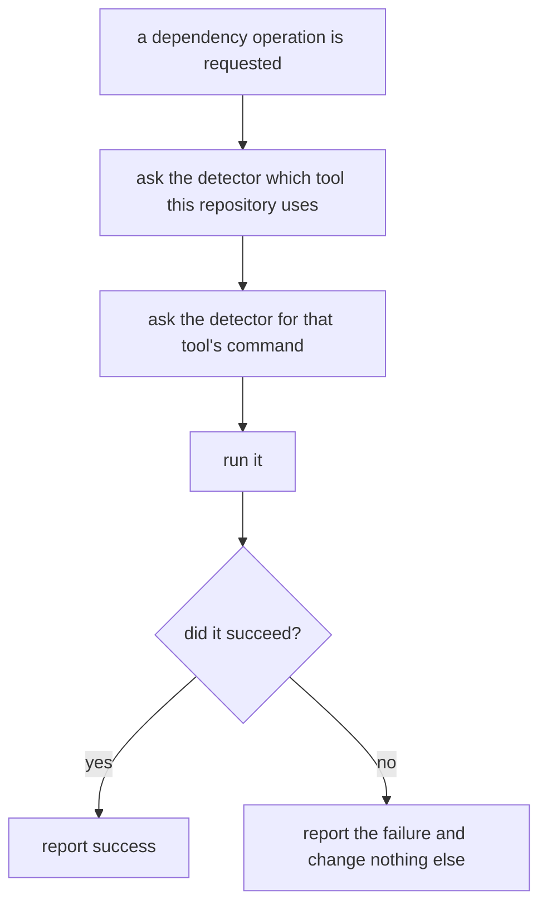

# Package manager operations

## What

Adding, removing, and upgrading dependencies on the repository's behalf. `add`, `remove`, and
`update` all need this, so it is specified once here rather than three times over.

**repobuddy does not work out which package manager to use, and does not build the commands.** Both
are delegated to [`package-manager-detector`](https://www.npmjs.com/package/package-manager-detector)
— see [ADR 0001](../../design/decisions/0001-delegate-package-manager-detection.md). It resolves the
tool from the repository (a declared `packageManager` field wins over the lockfile, and npm is the
fallback) and produces the right command for it, including yarn's split between `upgrade` on v1 and
`up` on berry, and bun.

That leaves this node with two promises of its own, and they are the parts that actually belong to
repobuddy:

1. **Operations go through the repository's own tool** — never a hardcoded npm.
2. **A failed operation changes nothing else.** The command reports what went wrong and stops before
   touching the configuration, so a repository is never left listing a plugin it does not have.

The detector's precedence and command table are *its* behavior, not ours. By the rule in
[`../../design/inherited-behavior.md`](../../design/inherited-behavior.md) they are recorded as
assumption 8 and guarded by a learning test, rather than asserted by scenarios here.

**Non-goals.** Which package a given command operates on, and what the configuration should say
afterward — the sibling command units. Choosing between package managers, or knowing their command
vocabularies — the detector's job. Installing anything during first-time setup: `init` deliberately
installs nothing (`../../initialization/`).

## Use Cases

| Use case | Trigger | Inputs | Outcome |
|---|---|---|---|
| **Run a dependency operation** | `add`, `remove`, or `update` needs to change the repository's dependencies | The operation and the package name | The repository's own package manager performs it, or the failure is reported and nothing else changes |

## Control Flow

Both decisions the old version of this graph drew — which tool, and which verb — have moved inside
`B` and `C`, where they are someone else's to get right.

## Scenario map

### Run a dependency operation

| Edge | Path (Given) | Scenario |
|---|---|---|
| `B → detector` | a repository whose package manager is not npm | `an operation runs through the repository's own package manager` |
| `E → yes` | the tool accepts the operation | `a successful operation is reported` |
| `E → no` | the tool exits with a failure | `a failed operation is reported and changes nothing else` |
