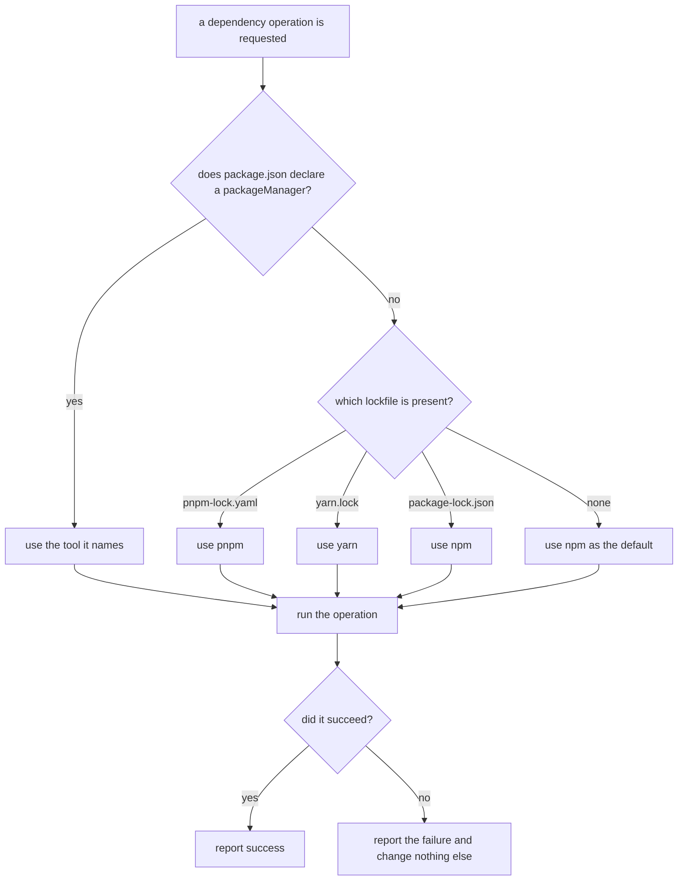

# Package manager operations

## What

Adding, removing, and upgrading dependencies on the repository's behalf — and first, working out
*which* tool to do it with. `add`, `remove`, and `update` all need this, so it is specified once here
rather than three times over.

repobuddy never assumes npm. It reads the repository to decide, preferring what the repository
**declares** over what it can be inferred to use: a `packageManager` field in `package.json` is an
explicit statement by the project and wins outright. Only when there is no such field does repobuddy
fall back to reading which lockfile is present, and only when there is no lockfile either does it
default to npm.

The other decision here is what happens when the tool fails — a package that does not exist, a
network that is down, a registry that refuses. **A failed dependency operation changes nothing
else.** The command reports what went wrong and stops before touching the configuration, so a
repository is never left listing a plugin it does not have.

**Open decision.** The precedence above (declared field, then lockfile, then npm) is this spec's
proposal rather than a user ruling. It follows corepack's model, where the `packageManager` field is
authoritative. Confirm before this node freezes.

**Non-goals.** Which package a given command operates on, and what the configuration should say
afterward — those belong to the sibling command units. Installing anything during first-time setup:
`init` deliberately installs nothing (`../../initialization/`).

## Use Cases

| Use case | Trigger | Inputs | Outcome |
|---|---|---|---|
| **Run a dependency operation** | `add`, `remove`, or `update` needs to change the repository's dependencies | The operation and the package name | The repository's own package manager performs it, or the failure is reported and nothing else changes |

## Control Flow

## Scenario map

### Run a dependency operation

| Edge | Path (Given) | Scenario |
|---|---|---|
| `B → yes` | package.json declares a tool and a different tool's lockfile is present | `a declared package manager wins over the lockfile` |
| `C → pnpm-lock.yaml` | no declared tool, a pnpm lockfile present | `a pnpm lockfile selects pnpm` |
| `C → yarn.lock` | no declared tool, a yarn lockfile present | `a yarn lockfile selects yarn` |
| `C → package-lock.json` | no declared tool, an npm lockfile present | `an npm lockfile selects npm` |
| `C → none` | no declared tool and no lockfile | `npm is used when nothing indicates otherwise` |
| `E → yes` | the operation is accepted by the tool | `a successful operation is reported` |
| `E → no` | the tool exits with a failure | `a failed operation is reported and changes nothing else` |
