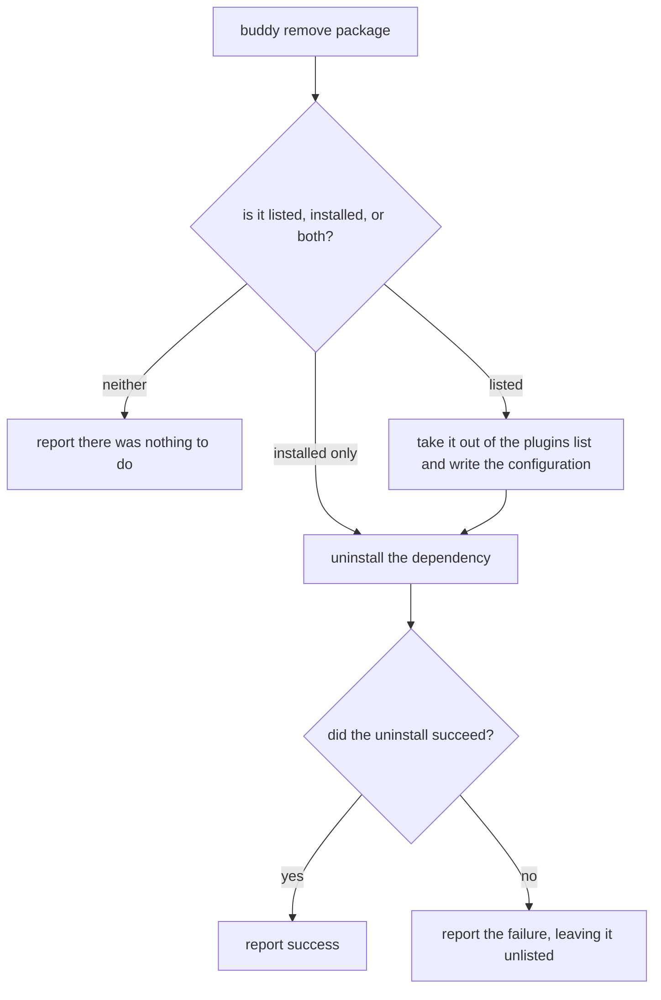

# Remove a plugin

## What

`buddy remove <package>` — drop a plugin the repository no longer wants. The exact mirror of
[`../add/`](../add/README.md): it takes the package out of the configuration's `plugins` list so its
commands stop appearing, and uninstalls the dependency.

**Always both halves.** There is no flag to deactivate a plugin while keeping the dependency
installed. A user who genuinely wants that can edit the configuration directly; carrying an option
for it would double this command's branches to serve a case the tool has no evidence anyone needs.

**Unlist first, uninstall second** — the opposite order from `add`, and for the same reason. `add`
installs first so a failure never leaves a plugin listed but missing; `remove` unlists first so a
failure never leaves one installed but unusable. Both orders exist to keep the configuration
truthful about what is actually loadable.

**Removing something the repository does not have is not an error.** If the package is neither
listed nor installed, the command reports that there was nothing to do and succeeds. This keeps
`remove` safe to repeat, the same property `init` has.

**Non-goals.** Adding or upgrading a plugin (sibling units); choosing or running the package manager
(`../package-manager/`).

## Use Cases

| Use case | Trigger | Inputs | Outcome |
|---|---|---|---|
| **Remove a plugin** | `buddy remove <package>` | A package name | The package is unlisted and uninstalled, or the command reports there was nothing to do |

## Control Flow

The `E → no` branch leaves the repository in the deliberate state described above: unlisted but still
installed. That is the safe side to fail on — an unused dependency costs disk, whereas a listed
plugin that cannot load costs every subsequent command a warning.

## Scenario map

### Remove a plugin

| Edge | Path (Given) | Scenario |
|---|---|---|
| `B → listed` | the package is both listed and installed | `removing a plugin unlists it and uninstalls it` |
| `B → neither` | the package is neither listed nor installed | `removing something the repository does not have reports nothing to do` |
| `B → installed only` | the package is installed but not listed | `removing an installed but unlisted package uninstalls it` |
| `E → no` | the package manager rejects the uninstall | `a failed uninstall still leaves the plugin unlisted` |
