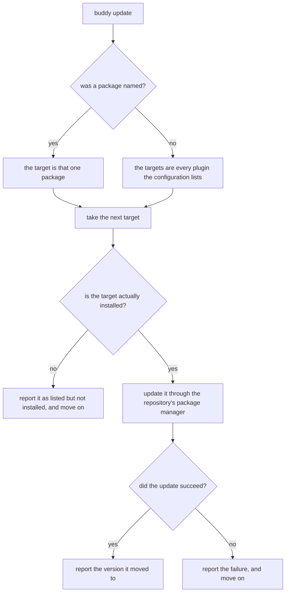

# Update a plugin

## What

`buddy update [package]` — move plugins to newer versions. Unlike `add` and `remove`, this touches
only the *installed* side: the configuration already lists these plugins and keeps listing them, so
nothing is written to it at all.

**With no package named, every listed plugin is updated.** That is the common case and the reason the
command exists — a repository with four plugins should not need four invocations. Naming a package
narrows it to that one.

**A plugin that is listed but not installed is reported, not silently skipped.** During a bulk
update this is the one thing a user cannot see for themselves, and it is a real state: someone edited
the configuration by hand, or an install failed earlier. The update continues with the rest.

**Non-goals.** Adding or removing a plugin (sibling units); updating dependencies that are not listed
plugins — that is the package manager's job, not repobuddy's; and changing the configuration, which
this command never does.

## Use Cases

| Use case | Trigger | Inputs | Outcome |
|---|---|---|---|
| **Update every plugin** | `buddy update` | The configuration's plugin list | Each listed plugin is moved to its newest version |
| **Update one plugin** | `buddy update <package>` | A package name | That plugin is moved to its newest version |

## Control Flow

Both failure edges *move on* rather than stopping. In a bulk update, abandoning the remaining plugins
because the second one failed would leave the repository in a state no one asked for and would make
the command's effect depend on the list's order.

## Scenario map

### Update every plugin

| Edge | Path (Given) | Scenario |
|---|---|---|
| `B → no` | a configuration listing two installed plugins | `updating with no package named updates every listed plugin` |
| `B → no` | a configuration listing no plugins | `updating with nothing listed does nothing` |
| `F → no` | two listed plugins, the first of which fails to update | `a plugin that fails to update does not stop the rest` |

### Update one plugin

| Edge | Path (Given) | Scenario |
|---|---|---|
| `B → yes` | a listed, installed package named on the command line | `updating a named plugin updates only that one` |
| `D → no` | a package listed in the configuration but not installed | `a listed plugin that is not installed is reported` |
| `A → update` | any — a listed, installed package | `updating never changes the configuration` |
