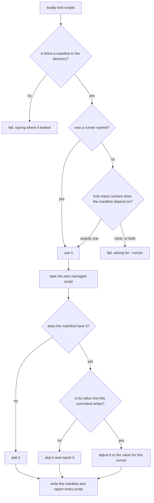

# Test scripts

## What

`buddy test-scripts` — putting the three scripts a repository runs its tests with into its
`package.json`, matching the test runner it actually uses. A repository that has installed a runner
still has to remember what to type in each script, and the two runners want different words for the
same three jobs.

The command works out the runner from the manifest's dependencies. A repository depending on `jest`
or on `@repobuddy/jest` uses jest; one depending on `vitest` or on `@repobuddy/vitest` uses vitest —
the preset counts because a repository can depend on the preset and get the runner transitively.
`--runner` names the runner directly, which is the answer when a repository depends on both or on
neither.

The values written are the runner's own plain invocations:

| Script | jest | vitest |
|---|---|---|
| `test` | `jest` | `vitest run` |
| `coverage` | `jest --coverage` | `vitest run --coverage` |
| `test:watch` | `jest --watch` | `vitest` |

**A script the repository customized is never clobbered.** What separates "adjust" from "clobber" is
the table above: a script whose current value is one of those values — for *either* runner — is one
this command wrote, and it is adjusted. Any other value is one the repository chose, and it is left
alone and reported as skipped. There is no `--force` and no prompting, for the same reason `init` has
none: reconciling a customized script against a generated one is a merge problem, and this command
does not have the standing to guess.

Two consequences follow, and both are the point. The command is **safe to repeat**: a second run
finds its own values and writes nothing. And a repository that **moved from jest to vitest** gets its
scripts moved with it, because the jest values are recognized as this command's own.

Only the three managed keys are touched. Other scripts keep their values, the scripts already there
keep their order, and the manifest keeps its own indentation — the file comes back as it was apart
from what changed.

**Non-goals.** Installing a runner — the command reads dependencies, it never adds one (that is
`../plugin-management/add/`); configuring the runner itself (the `@repobuddy/jest` and
`@repobuddy/vitest` packages own that); and any script that is not one of the three named here.

## Use Cases

| Use case | Trigger | Inputs | Outcome |
|---|---|---|---|
| **Set the test scripts** | `buddy test-scripts` | The project directory, its manifest, and optionally a named runner | The three scripts hold the values for the runner, except where the repository customized one |

## Control Flow

`H → no` is the rule that keeps the command non-destructive, and `H → yes` is the only door through
which an existing value is ever overwritten.

## Scenario map

### Set the test scripts

| Edge | Path (Given) | Scenario |
|---|---|---|
| `B → no` | a directory with no manifest | `the command fails when there is no manifest to adjust` |
| `D → one` | a repository depending on jest | `a project using jest gets the jest scripts` |
| `D → one` | a repository depending on a repobuddy preset only | `the preset for a runner counts as depending on that runner` |
| `D → none` | a repository depending on neither runner | `the command fails when no runner can be found` |
| `D → both` | a repository depending on both runners | `the command fails when both runners are present` |
| `C → yes` | a repository depending on both runners, with a runner named | `a named runner settles which scripts are written` |
| `G → no` | a repository with none of the managed scripts | `a missing script is added` |
| `G → no` | a repository with scripts of its own | `scripts the command does not manage are left as they are` |
| `H → yes` | a repository whose scripts hold the other runner's values | `scripts left from another runner are adjusted` |
| `H → no` | a repository whose `test` script is customized | `a customized script is skipped and left alone` |
| `A → run` | any — the command run a second time | `running test-scripts twice leaves the same manifest` |
