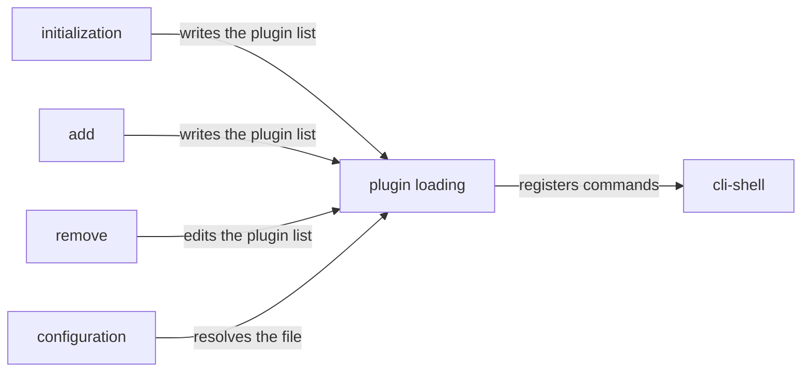

# Workflows

## What

The paths a real user walks across several capabilities, as opposed to any single command in
isolation. A workflow is the project-level counterpart of a use case: it starts from a real situation
and ends when the user has what they came for.

These matter because repobuddy's capabilities are only useful in combination, and every one of them
communicates with the others through the same narrow channel — the configuration file. `init` and
`add` write the plugin list, `plugin-management` reads and edits it, and loading turns it into
commands. Each capability node proves its own half; only a workflow proves the halves meet.

**Non-goals.** Re-testing what a single capability already covers. A scenario earns its place here
only by asserting something about a **seam** — a fact no single node can establish because it spans
two of them.

## Use Cases

| Workflow | Starts from | Ends when |
|---|---|---|
| **Set a fresh repository up** | A repository that has never used repobuddy | A plugin's command is available to run |
| **Adopt repobuddy where plugins are already installed** | A repository already depending on plugins, with no configuration | Those plugins' commands work without being added by hand |
| **Retire a plugin** | A repository with a working plugin | Its commands are gone and the dependency is not installed |

## Control Flow

Each workflow is a path through capabilities rather than a decision graph of its own. The seam under
test is the arrow between two boxes, never a box.

The decision this graph makes visible: **what one capability writes, another must be able to read on
the very next run.** Nothing caches, and nothing carries state between runs except the configuration
file and the installed dependencies.

## Scenario map

### Set a fresh repository up

| Edge | Path (Given) | Scenario |
|---|---|---|
| `add → loading` | a repository with no configuration and no plugins | `a plugin added to a fresh repository is usable on the next run` |
| `initialization → loading` | a fresh repository, initialized before anything is added | `a repository initialized and then added to loads the plugin` |

### Adopt repobuddy where plugins are already installed

| Edge | Path (Given) | Scenario |
|---|---|---|
| `initialization → loading` | a repository already depending on a plugin, with no configuration | `init makes an already-installed plugin usable without naming it` |

### Retire a plugin

| Edge | Path (Given) | Scenario |
|---|---|---|
| `remove → loading` | a repository with a working plugin | `a removed plugin's commands are gone on the next run` |
| `configuration → loading` | a repository whose configuration sits in a parent directory | `a plugin listed at the repository root works from a subdirectory` |
